本文为笔者参与书生大模型实战营第四期的关卡任务实现记录。在此仅作流程演示和简要说明。如果想了解更多关于原理和不同实现方式的细节，强烈推荐参考主办方提供的[说明文档](https://github.com/InternLM/Tutorial/blob/camp4/docs/L0/linux/readme.md)。

# L0 Linux+InternStudio 篇

关卡任务如下：

1. 完成 SSH 连接与端口映射并运行`hello_world.py`
2. 将 Linux 基础命令在开发机上完成一遍（选做）
3. 使用 VSCODE 远程连接开发机并创建一个 conda 环境（选做）
4. 创建并运行`test.sh`文件（选做）

本文使用 vscode 远程链接，将任务 3 并入任务 1。本文小标题如下：

1. 完成 SSH 连接与端口映射并运行`hello_world.py`
2. 将 Linux 基础命令在开发机上完成一遍
3. 创建并运行`test.sh`文件

### 1. 完成 SSH 连接与端口映射并运行`hello_world.py`

#### 1.1 链接到开发机

首先在云平台创建开发机实例
平台提供了登录命令和密码，使用 powershell 输入登陆命令和密码即可。

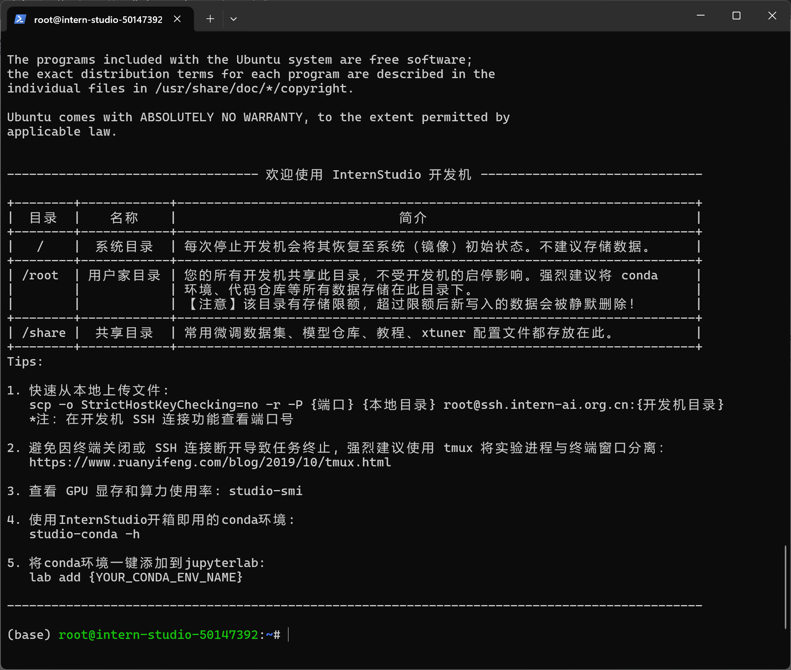

#### 1.2 配置 ssh

配置 ssh 是为了不用每次链接都输入密码。

首先在本地生成密钥
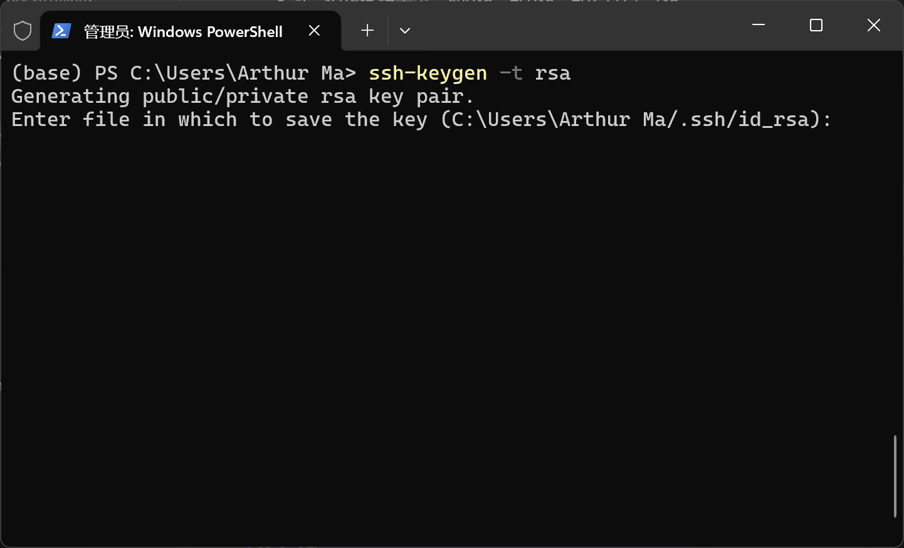
之后使用 Get-Content 指令读出公钥
此处有个小坑：默认的公钥保存路径是"C:/Users/{用户名}/.ssh/id_rsa.pub" 如果用户名有空格，需要给路径加上引号，即'Get-Content "C:/Users/{用户名}/.ssh/id_rsa.pub"', 否则会报错‘找不到参数“{用户名后半段}/.ssh/id_rsa.pub”的形式参数’。

读出公钥后，添加 ssh 公钥到远程开发机即可。

#### 1.3 vscode 配置 ssh

配置 ssh 用 vscode 方便地浏览和编辑远程开发机文件。

在 vscode 中打开 Remote-ssh 插件，新建远程连接，输入登录指令即可。
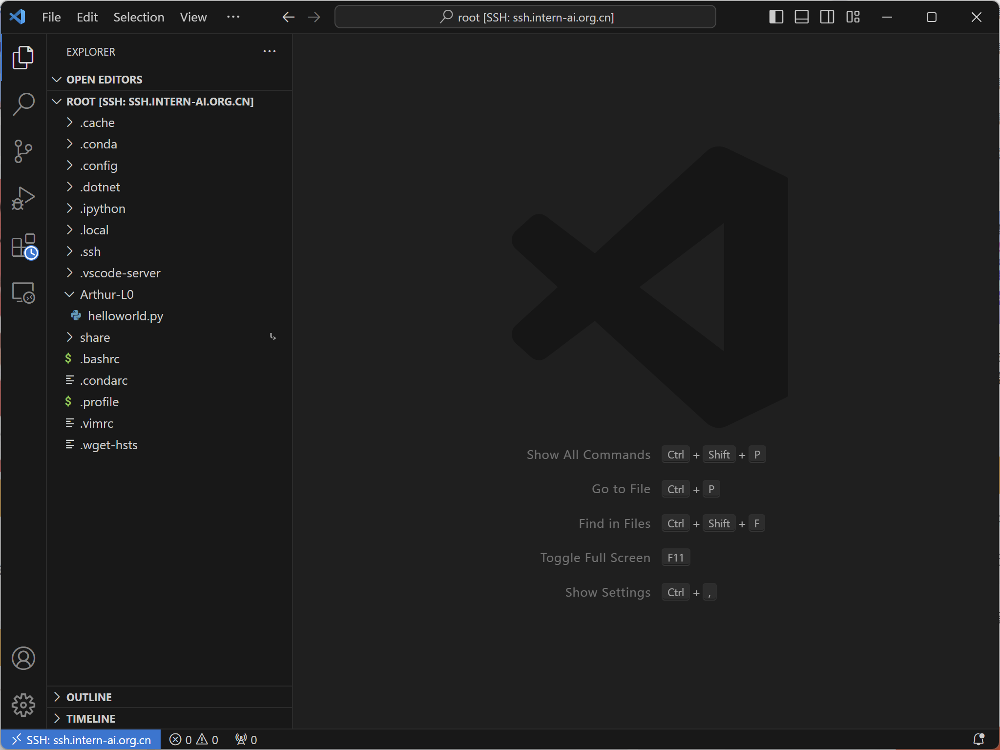

#### 1.4 端口映射

端口映射之后，可以用本地浏览器打开运行在远程开发机的 web app 页面。

vscode 点击端口(Port)-添加端口(Add Port)，指定端口映射 xxxx(本文使用了 6789 端口)
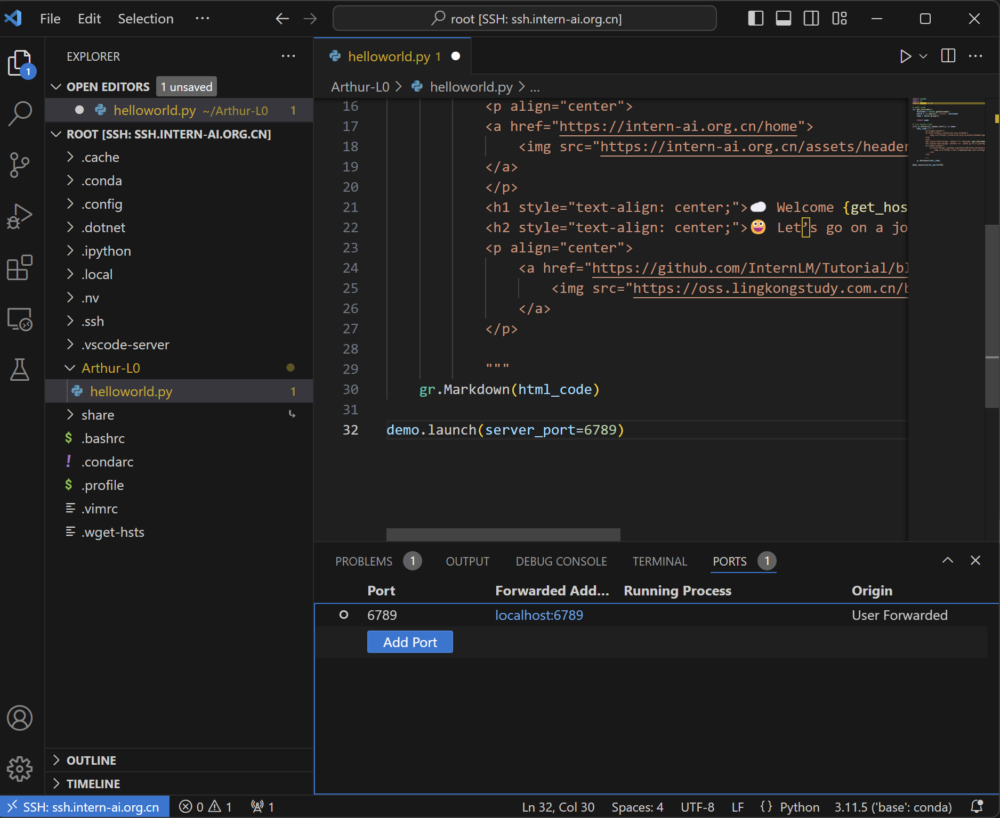

#### 1.5 运行文件

首先编辑 HelloWorld.py, 在代码 demo.launch 中添加“server_port=xxxx”参数。

运行文件，即可用本地浏览器打开界面。
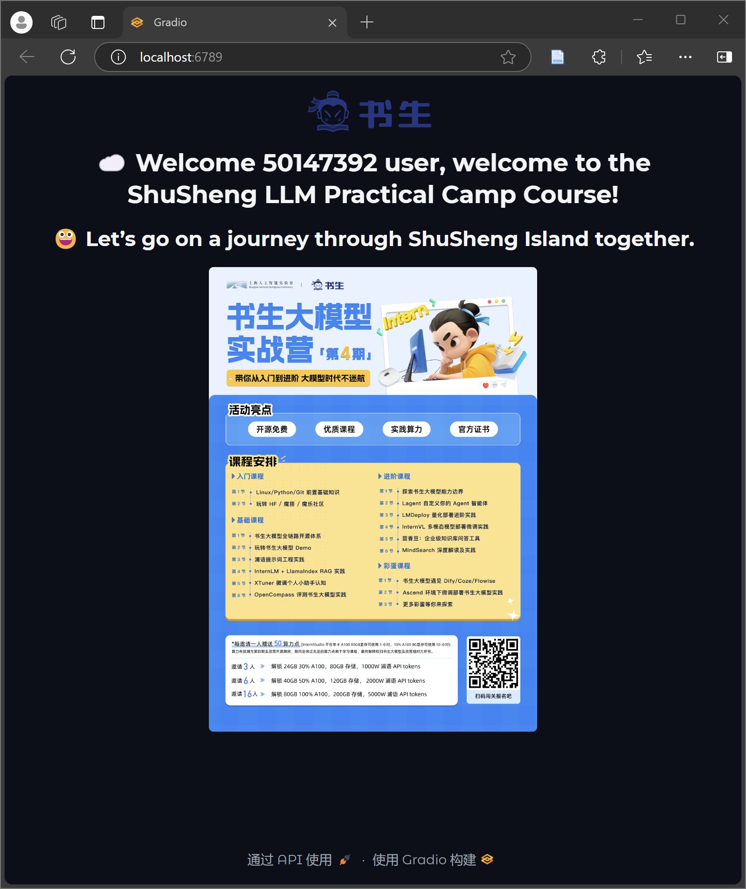

### 2. 将 Linux 基础命令在开发机上完成一遍

#### 2.1 ln 指令用于链接

笔者在尝试 ln 指令的时候，出了几个 bug，因此研究了一波 ln 指令，在此尝试对文档做一点补充。

##### 2.1.1 原理：文件模型

从原理来说，linux 操作系统的文件模型定义了四种对象:

superblock（超级块）：存储文件系统基本的元数据，如文件系统的类型、大小、状态。一个超级块对应一个文件系统（例如 ext2）。

index node（inode）：保存单个文件的元数据，包括文件的大小、链接数量、指向存储该内容的磁盘区块的指针等，但不包括这个文件的名称。每个文件和目录都有 inode 对应。

directory entry（目录项）：保存文件/目录名称和 inode 的对应关系，用来实现从文件路径到 inode 的映射。

file: 一组逻辑上相关联的数据。

##### 2.1.2 ln 指令对 inode 和 dentry 的影响

a. 硬链接 `ln {目录1} {目录2}`：

{目录1} 和 {目录2} 会指向同一个inode号。当使用rm删除硬链接时会减少链接数量，当链接数为0，文件就被删除了

b. 软连接 `ln -s {目录1} {目录2}`：
链接内容是它所指向的文件名，符号链接文件有自己的inode，rm会删除链接文件。

#### 2.1.3 实际操作

实践中软链接可以用于配置环境，我们可以举个例子：

我们首先新建两个文件夹testdir1和testdir2，
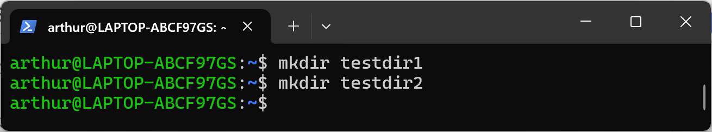

然后在testdir1中创建一个文件hw.sh:
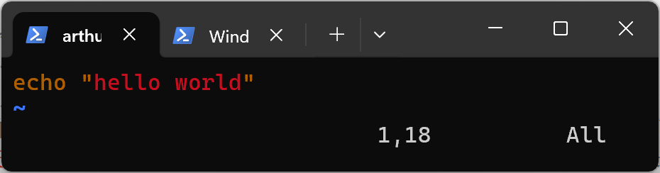
此时在testdir1目录下可以执行hw.sh文件：
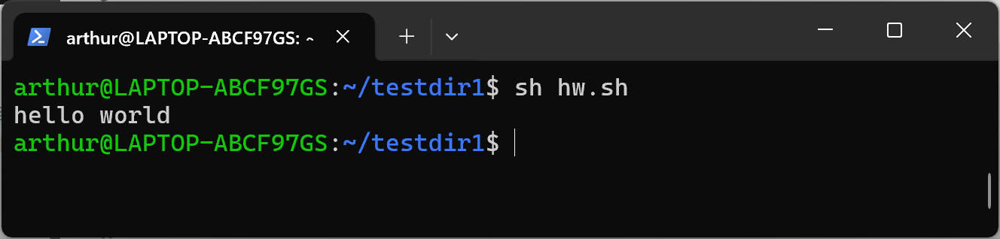

我们在testdir2中创建一个指向testdir1的软连接
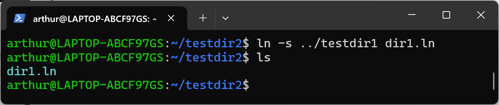
此时在testdir2目录下，也可以执行hw.sh文件，这种软连接操作可以代替配置环境变量。
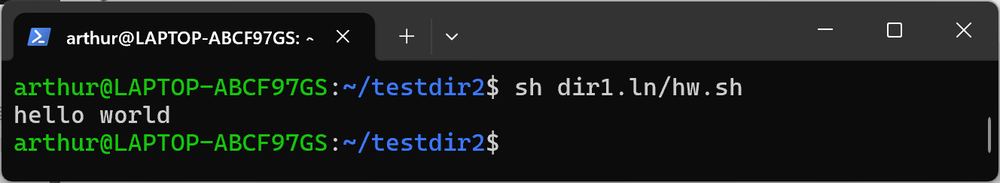

#### 2.2 pstree 指令用于查看进程树

首次在开发机上运行`pstree`指令时，可能会报错`bash: command pstree not found`
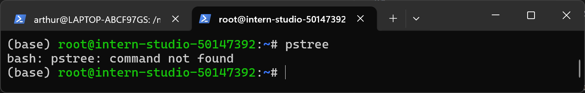

这是因为部分 linux 发行版默认没有安装`pstree`指令，可以使用`apt-get install psmisc`指令安装。
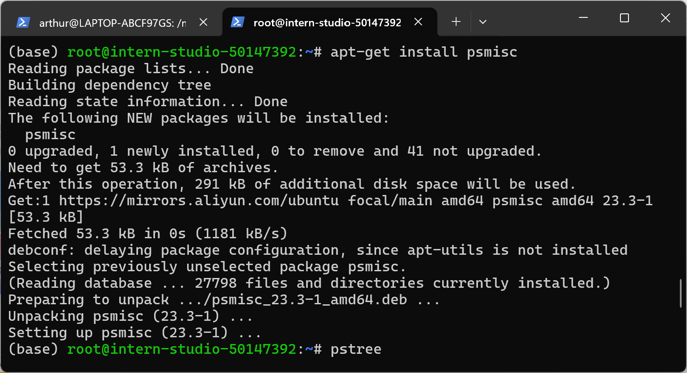

安装后即可正常运行，运行结果如下：
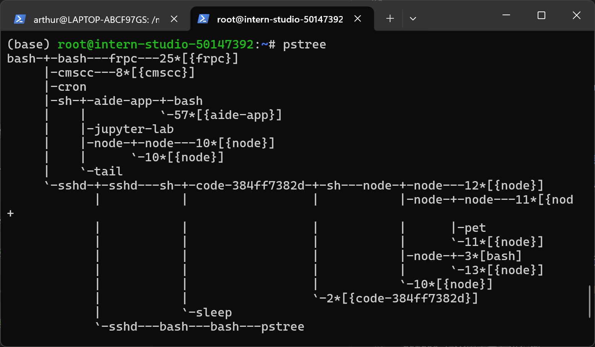

考虑到潜在读者的阅读体验，ls pwd cd mkdir 等基础指令执行在此不加赘述。

### 3. 创建并运行 test.sh

test.sh 用于快速导出和还原虚拟环境。在此我们首先使用 conda 导出和还原，然后展示使用 test.sh 导出和还原。

#### 3.1 conda 导出和还原虚拟环境

首先创建虚拟环境 testenv，
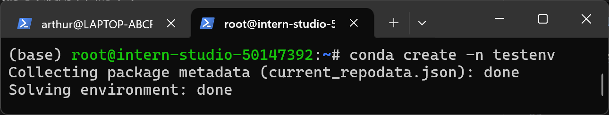

然后激活虚拟环境，并导出到 testenv.yml
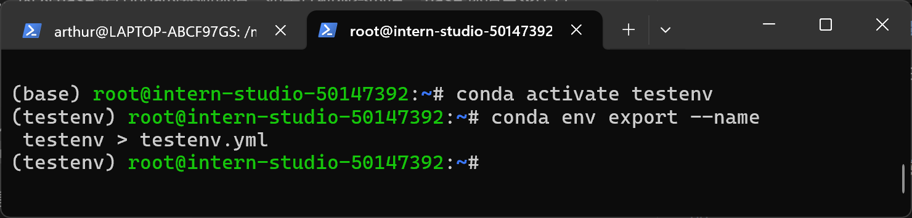

可以看到，testenv.yml 文件中什么也没有，因为我们没有安装任何包。
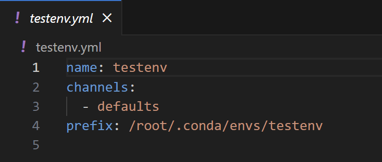

使用指令 conda env create -n testenv-2 -f testenv.yml 还原一个虚拟环境。
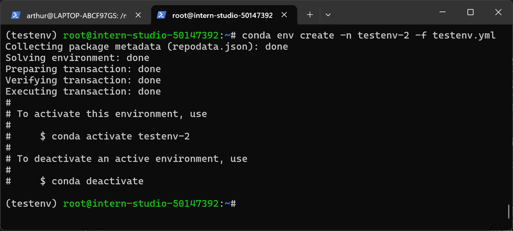
可以看到还原的虚拟环境 testenv-2。
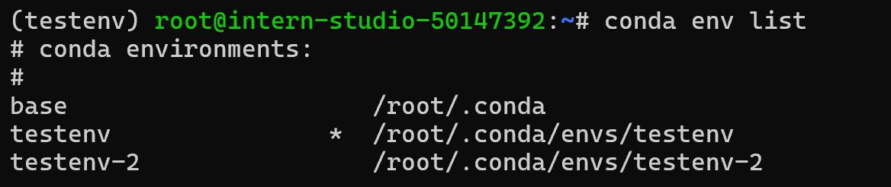

#### 3.2 使用 test.sh 导出和还原虚拟环境

test.sh 被用来自动化上述过程，首先创建 test.sh 文件。
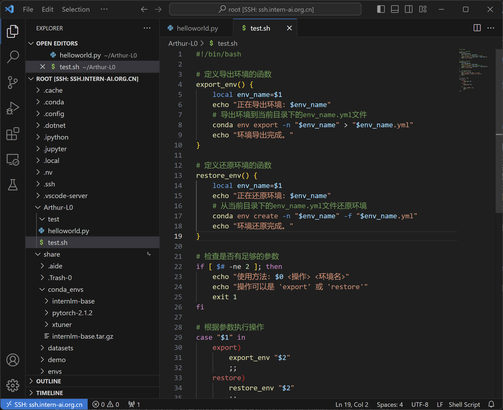

使用指令 chmod +x test.sh 赋权，然后./test.sh export testenv 即可导出环境 testenv。
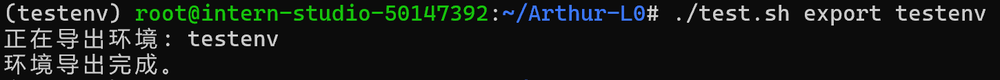

为了展示还原效果，我们先在 conda 中删除 testenv。
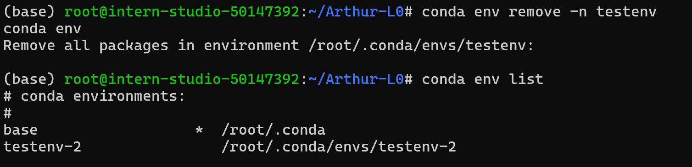

使用./test.sh restore testenv 即可还原。
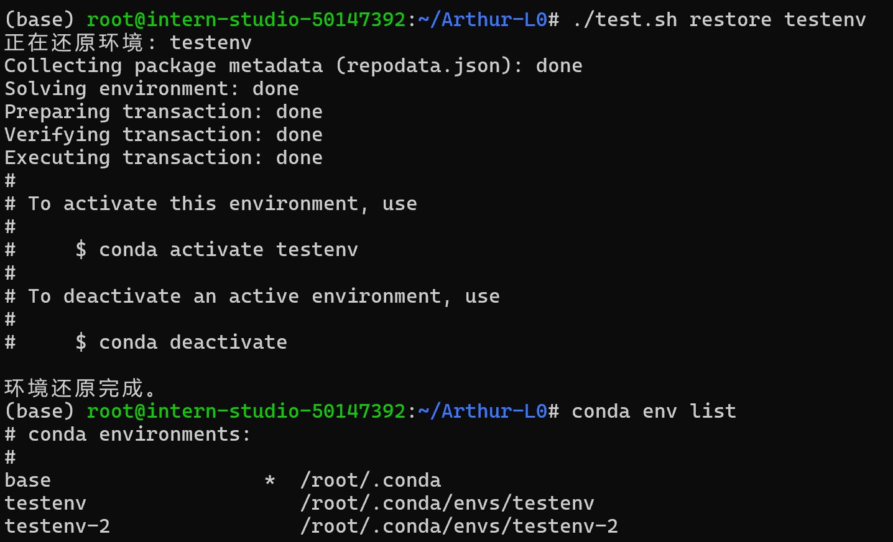
