本文为笔者参与书生大模型实战营第四期的关卡任务实现记录。在此仅作流程演示和简要说明。如果想了解更多关于原理和不同实现方式的细节，强烈推荐参考主办方提供的[说明文档](https://github.com/InternLM/Tutorial/blob/camp4/docs/L0/maas/readme.md)。

# l0-maas 课程任务

maas 课程任务如下：

1. 模型下载 使用 Hugging Face(HF)/魔搭/魔乐任意平台下载指定模型，包括 config.json 文件、model.safetensors.index.json 文件。
2. 模型上传（可选）将下载好的 config 上传到对应平台
3. Space 上传（可选）在 HF 平台上使用 Spaces 部署 intern_cobuild

本文小标题如下：
1. 模型下载
2. 模型上传
3. Space部署

# 1. 模型下载

## 1.1 本地下载示例
以Hugging Face为例，首先我们需要登录平台：
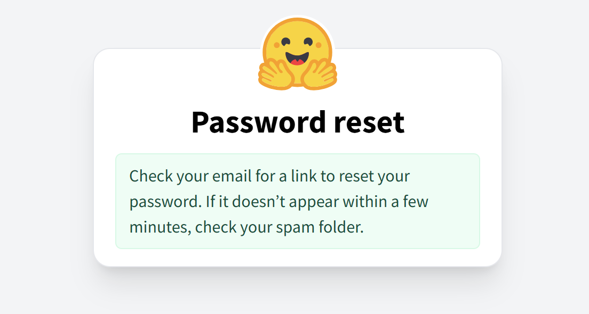

按照[参考链接](https://huggingface.co/internlm/internlm2_5-7b)找到书生大模型
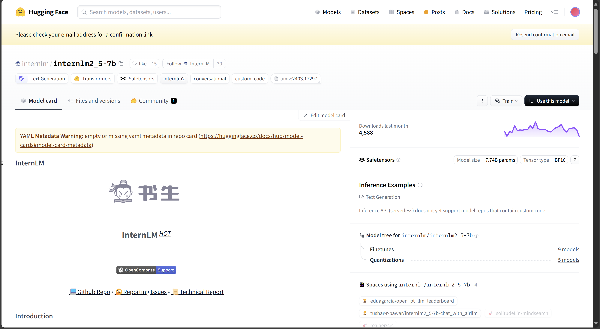

点击“Files and versions”即可查看模型文件，点击文件名右侧下载图标即可下载
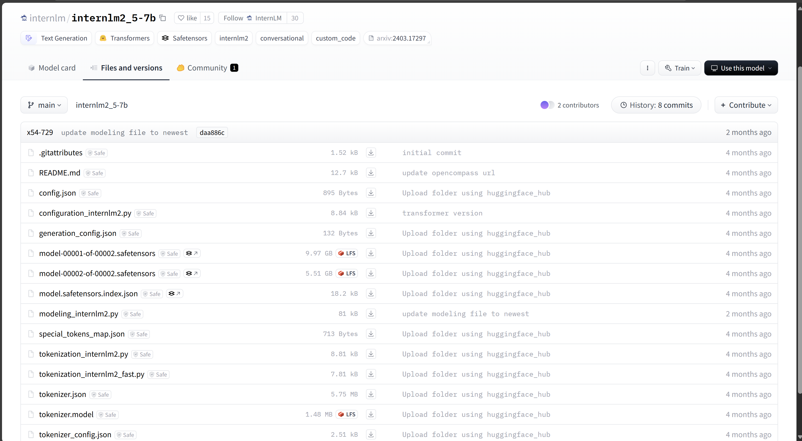

## 1.2 服务器端下载示例
以Github CodeSpace为例，我们首先新建一个 CodeSpace"InternLM-L0"，这里笔者选择的是 Jupyter Notebook 模板
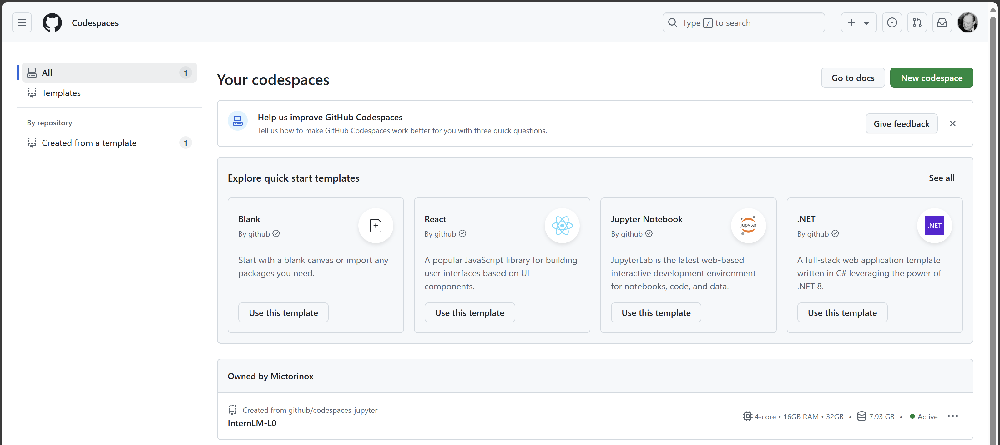

进入 codespace 之后，我们新建源文件 “L0-download.ipynb” 并安装依赖包
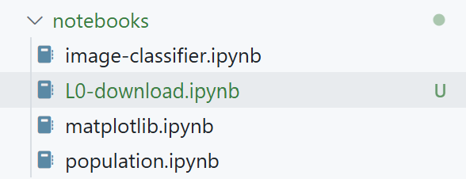

把如下代码粘贴进代码块，并运行
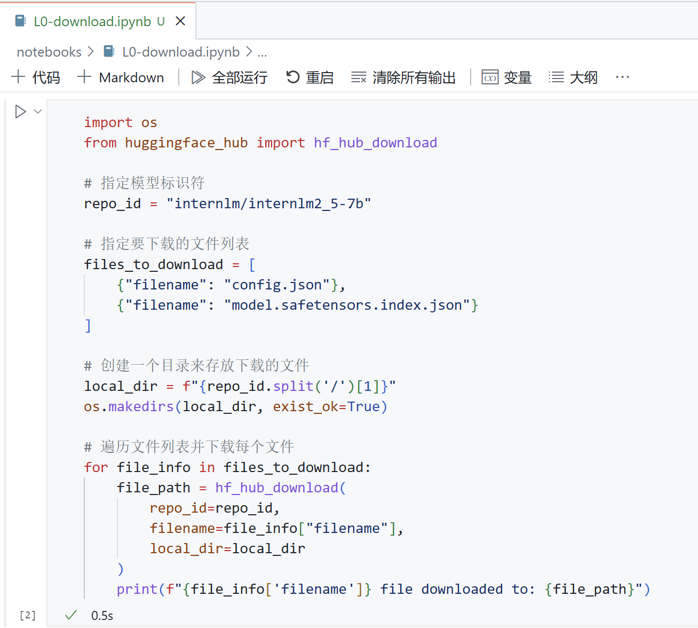

可以看到运行之后，config.json 和model.safetensors.index.json 这两个配置文件就下载好了
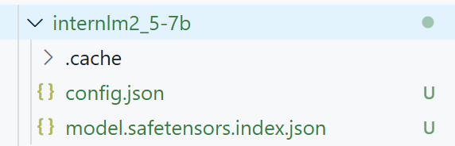

# 2. 模型上传
## 2.1 安装git lfs

为了实现对大文件的支持，需要先安装git lfs

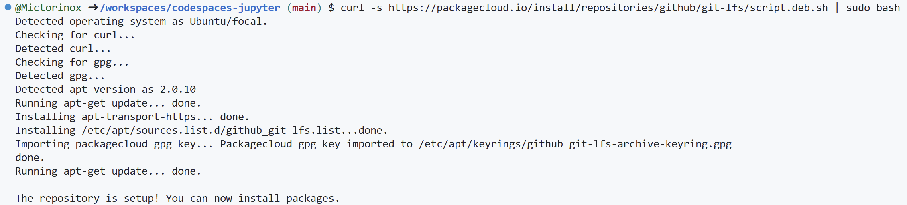

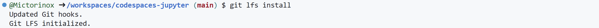

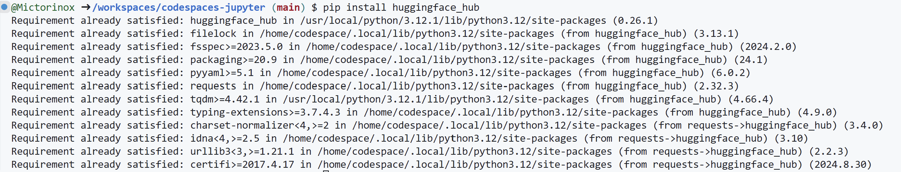

## 2.2 模型上传
通过git push实现模型上传

首先在github codespace登录hugging face-cli 
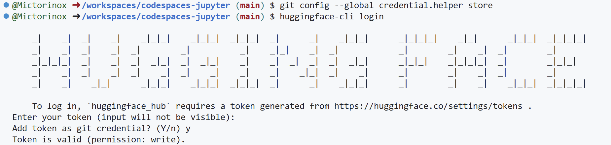

创建项目
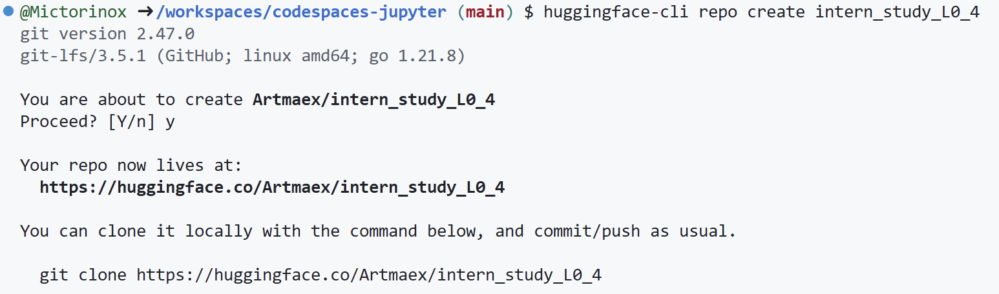
在此我们新建了一个项目 intern_study_L0_4, 我们将它clone到codespace

修改文件，将config.json粘贴进文件夹，新建README.md
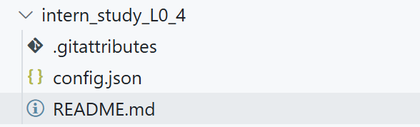

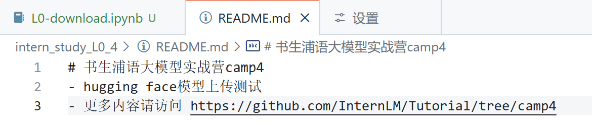

git commit push, 需要在Hugging Face Space设置登录Token[参考链接](https://huggingface.co/blog/zh/password-git-deprecation)
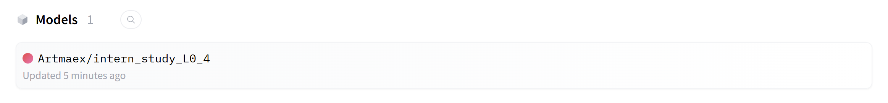

# 3. Space上传
以Hugging Face为例进行在线部署

## 3.1 新建Hugging Face Space
Hugging Face是一个托管

首先新建一个Hugging Face Space，在hugging face首页点Spaces，然后点击Create New Space
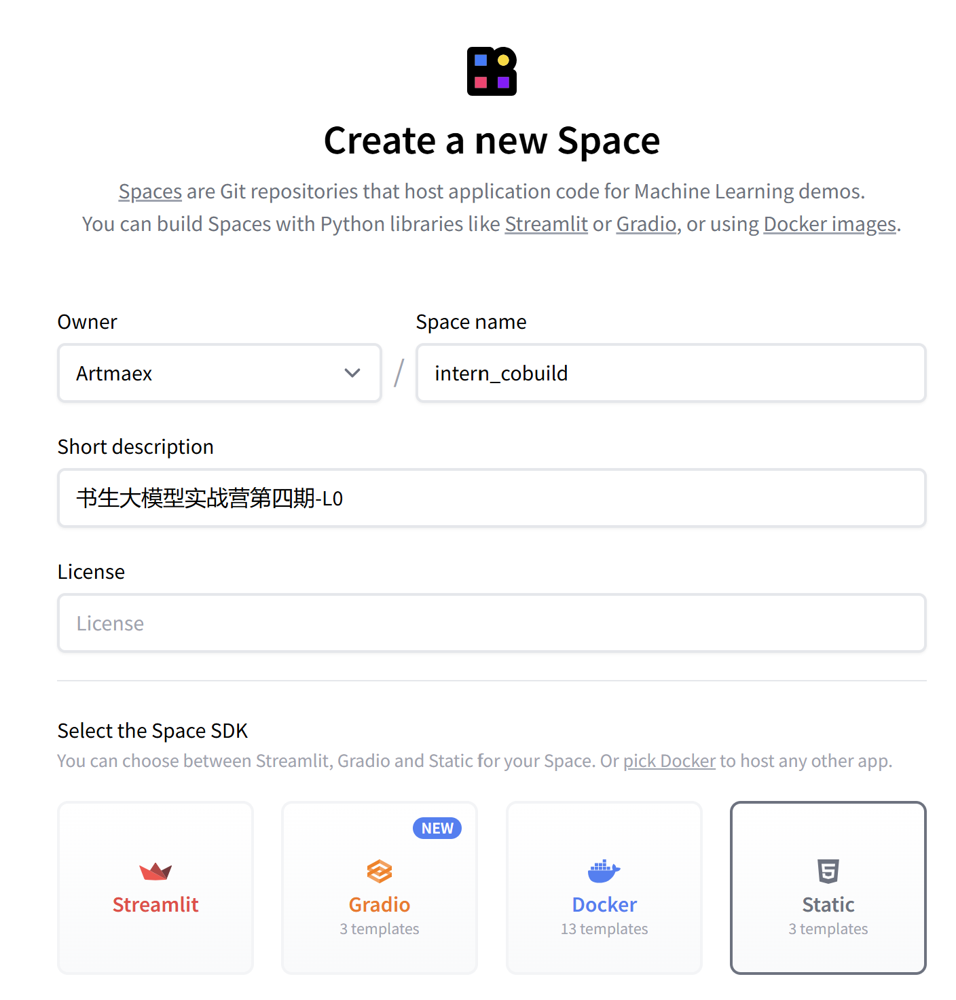

创建成功后可以在搜索栏搜到新建的space
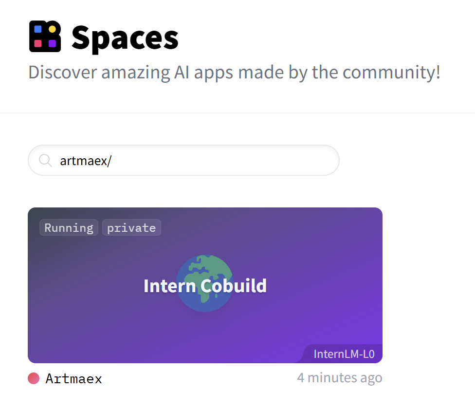

点击space会跳转到space的主页index.html
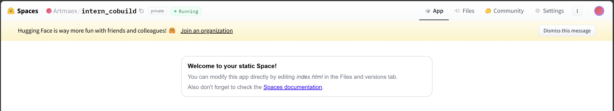

接下来修改index.html，我们首先点击右上角的Files，查看所有文件
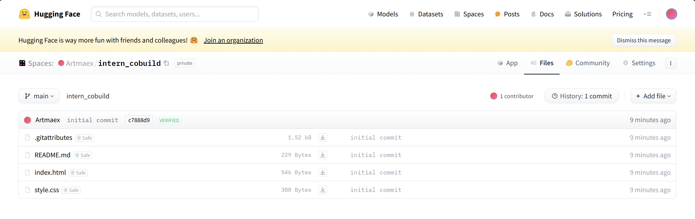

点击index.html修改
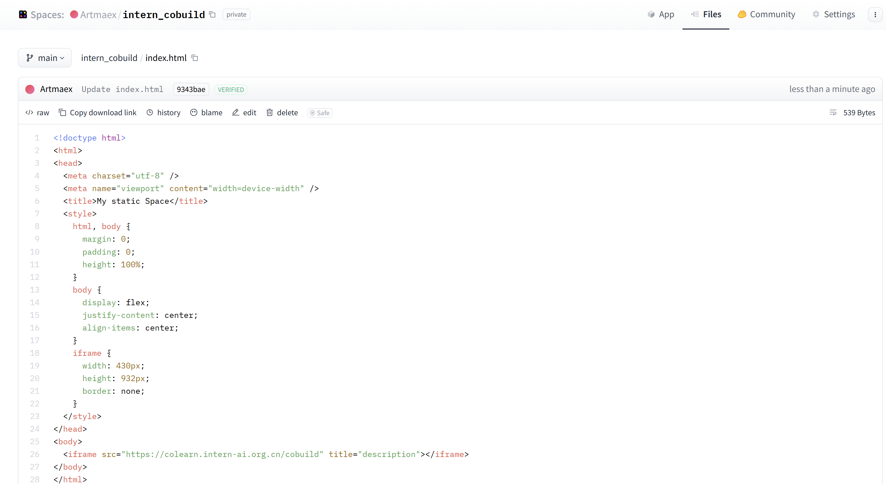

## 3.2 将托管仓库链接到服务器（以GitHub Codespace为例）

实践中我们需要在服务器端对模型进行操作，因此需要连接到托管仓库，这里我们以GitHub Codespace为例。

首先在codespace打开终端，git clone托管仓库
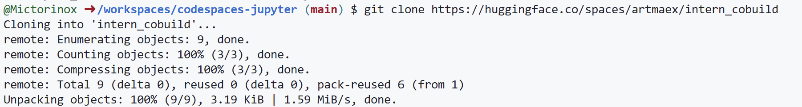

由于主页已经修改完了，我们在此处新建一个hw.py, 以展示对仓库的修改
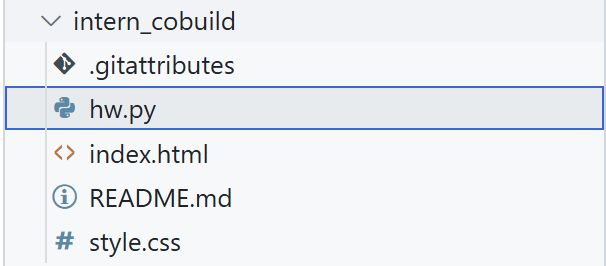

在终端执行git commit
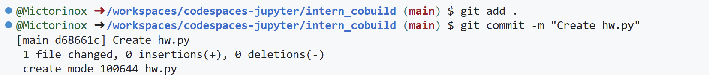

在git push之前，需要在Hugging Face Space设置登录Token

然后执行git push
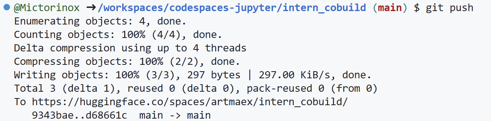

回到hugging face space主页，查看文件，可以看到hw.py已经同步了仓库
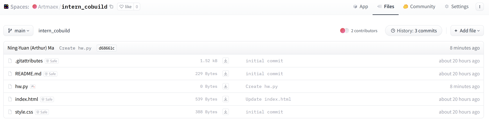
