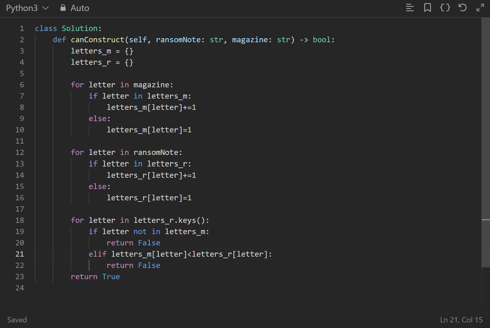
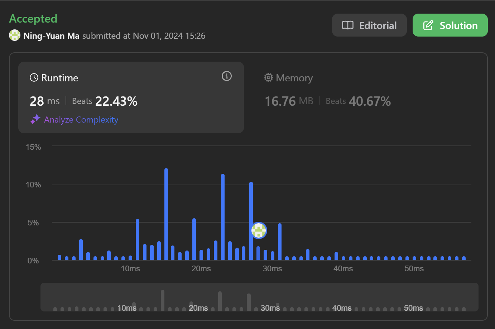
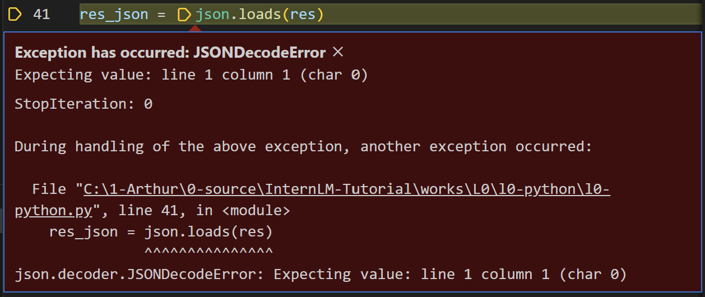
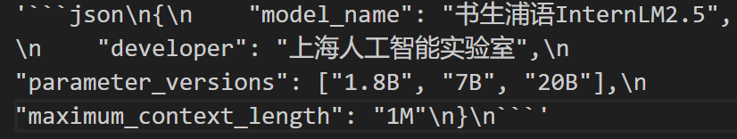
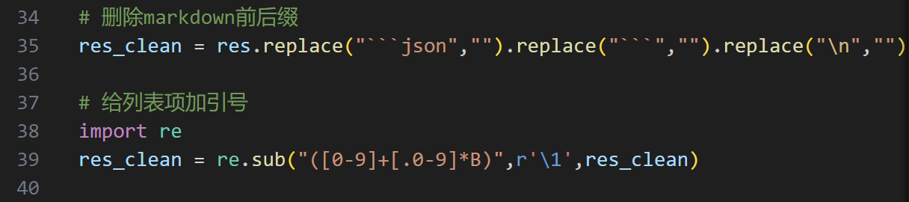
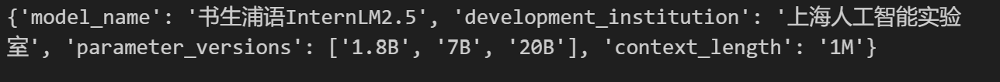
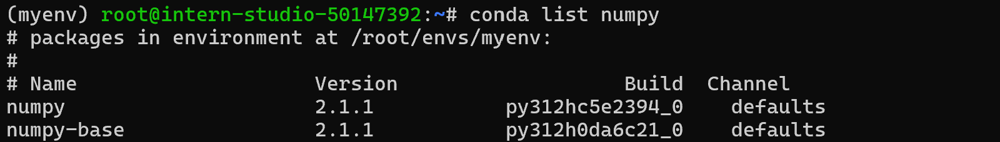
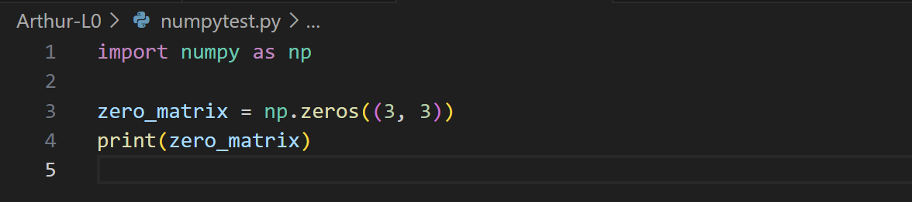
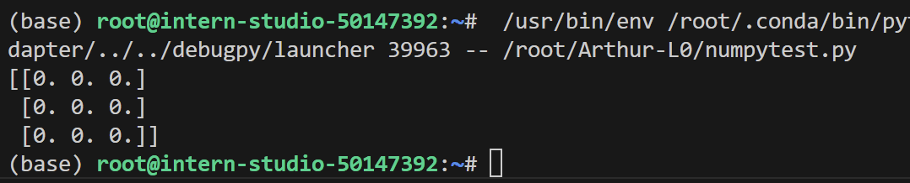

本文为笔者参与书生大模型实战营第四期的关卡任务实现记录。在此仅作流程演示和简要说明。如果想了解更多关于原理和不同实现方式的细节，强烈推荐参考主办方提供的[说明文档](https://github.com/InternLM/Tutorial/blob/camp4/docs/L0/python/readme.md)。

# 课程任务

maas 课程任务如下：

1. Leetcode 383(笔记中提交代码与 leetcode 提交通过截图)
2. Vscode 连接 InternStudio debug 笔记
3. (可选) pip 安装到指定目录

本文小标题如下：
1. Leetcode 383
2. InternStudio debug
3. numpy 安装

# 1. Leetcode 383

题面：已知两个字符串 a 和 b，要求用 b 中字符拼出字符串 a，每个字符串只能用一次。如果能，函数返回 True，否则返回 False。

我们写一个最简单的，用字典分别统计 a，b 两个字符串中每个字符出现次数，然后比较大小，如果 a 比 b 中多，则不能。


提交，ac


# 2. InternStudio debug

首先配置运行原版代码，报错"JSONDecodeError"，

看起来是报文结构问题，我们查看返回的报文变量 res，变量值如下：

llm返回的报文不稳定，笔者在尝试是出现的情况有：1.前后加上了 markdown 代码块前后缀，需要删除；2."parameter_version"数组内字符串没有加引号；3.有多余的换行符。因此我们添加如下代码并运行

解析正常，控制台返回结果如下：

完整代码如下：
```python
import os
from openai import OpenAI
import json
def internlm_gen(prompt,client):
    '''
    LLM生成函数
    Param prompt: prompt string
    Param client: OpenAI client 
    '''
    response = client.chat.completions.create(
        model="internlm2.5-latest",
        messages=[
            {"role": "user", "content": prompt},
      ],
        stream=False
    )
    return response.choices[0].message.content

# 需要设置环境变量"InternLM_API_key",变量值为API Token
api_key = os.getenv("InternLM_API_key")
client = OpenAI(base_url="https://internlm-chat.intern-ai.org.cn/puyu/api/v1/",api_key=api_key)

content = """
书生浦语InternLM2.5是上海人工智能实验室于2024年7月推出的新一代大语言模型，提供1.8B、7B和20B三种参数版本，以适应不同需求。
该模型在复杂场景下的推理能力得到全面增强，支持1M超长上下文，能自主进行互联网搜索并整合信息。
"""
prompt = f"""
请帮我从以下``内的这段模型介绍文字中提取关于该模型的信息，要求包含模型名字、开发机构、提供参数版本、上下文长度四个内容，以json格式返回。
`{content}`
"""
res = internlm_gen(prompt,client)


# 删除markdown前后缀
res_clean = res.replace("```json","").replace("```","")

# 给列表项加引号
import re
res_clean = re.sub("([0-9]+[.0-9]*B)",r'\1',res_clean)

res_json = json.loads(res_clean)
print(res_json)
```

# 3. numpy 安装

任务是在指定位置创建环境并安装 numpy 包

使用代码如下
```bash
conda create --prefix /root/envs/myenv python=3.9
conda activate /root/envs/myenv
conda install numpy
```
安装完成后可以用`conda list numpy`查看当前环境下安装的numpy包

写一个简单的numpy程序

运行后输出结果

安装成功