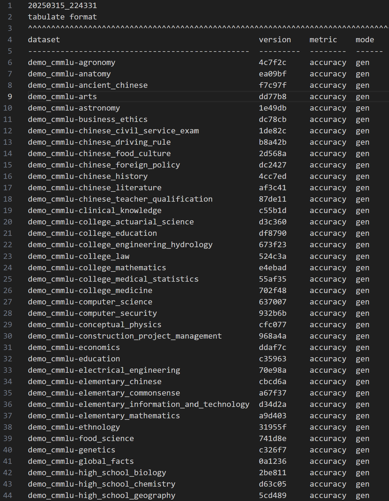
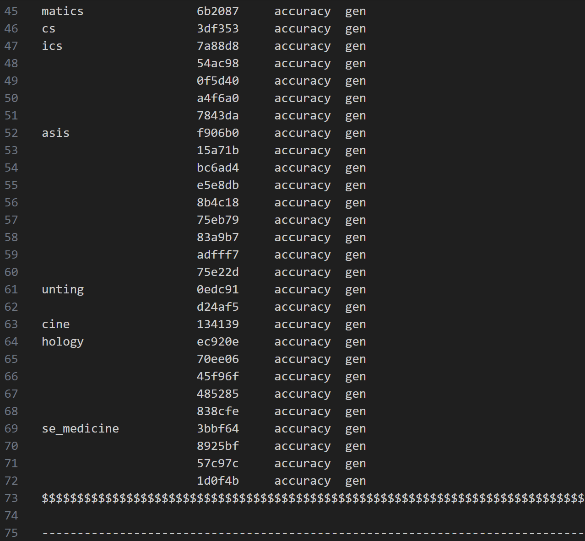

本文为笔者参与书生大模型实战营第四期的关卡任务实现记录。在此仅作流程演示和简要说明。如果想了解更多关于原理和不同实现方式的细节，强烈推荐参考主办方提供的[说明文档](https://github.com/InternLM/Tutorial/blob/camp4/docs/L1/Evaluation/README.md)。

# 前言

开发大模型应用需要选择合适的基座模型。对于模型的评估和比较，首先可以参考现成的评测榜单，此外更好的是在实际部署的环境对模型开展评测。上海人工智能实验室的 Opencompass 平台既提供了国内认可度较高的大模型榜单，也提供了一站式的本地评测工具。本文实现了使用opencompass的本地评测工具分别评测api大模型接口、本地部署的大模型、以及本地以api形式部署的大模型。


# 课程任务

l1-evaluation 课程任务如下：
1 使用 OpenCompass 评测浦语 API 记录复现过程并截图。
2 使用 OpenCompass 评测 internlm2.5-chat-1.8b 模型在 c-eval 数据集上的性能，记录复现过程并截图。（可选）
3 使用 OpenCompass 进行主观评测（选做）
4 使用 OpenCompass 评测 InternLM2-Chat-1.8B 模型使用 LMDeploy 部署后在 ceval 数据集上的性能（选做）

# 1. 配置环境

首先创建虚拟环境并激活
conda create -n opencompass python=3.10
conda activate opencompass

安装依赖环境，包括 1.使用源代码方式安装 opencompass 库；2. pip 安装 huggingface hub 库

```sh
cd /root
git clone -b 0.3.3 https://github.com/open-compass/opencompass
cd opencompass
pip install -e .
pip install -r requirements.txt
pip install huggingface_hub==0.25.2

pip install importlib-metadata
```

# 2. 评测模型

## 评测 api 模型

1. 首先需要获取待评测的模型的 api key，并且导入系统环境变量。本文导入变量名为“InternLM_API_key”。

2. 然后，在 opencompass/opencompass/configs/models/openai/puyu_api.py，并输入以下代码：

```python
import os
from opencompass.models import OpenAISDK


internlm_url = 'https://internlm-chat.intern-ai.org.cn/puyu/api/v1/' # 你前面获得的 api 服务地址
internlm_api_key = os.getenv('InternLM_API_key')

models = [
    dict(
        # abbr='internlm2.5-latest',
        type=OpenAISDK,
        path='internlm2.5-latest', # 请求服务时的 model name
        # 换成自己申请的APIkey
        key=internlm_api_key, # API key
        openai_api_base=internlm_url, # 服务地址
        rpm_verbose=True, # 是否打印请求速率
        query_per_second=0.16, # 服务请求速率
        max_out_len=1024, # 最大输出长度
        max_seq_len=4096, # 最大输入长度
        temperature=0.01, # 生成温度
        batch_size=1, # 批处理大小
        retry=3, # 重试次数
    )
]
```

3. 配置数据集：
   新建并编辑 `opencompass/configs/datasets/demo/demo_cmmlu_chat_gen.py`

```py
from mmengine import read_base

with read_base():
    from ..cmmlu.cmmlu_gen_c13365 import cmmlu_datasets


# 每个数据集只取前2个样本进行评测
for d in cmmlu_datasets:
    d['abbr'] = 'demo_' + d['abbr']
    d['reader_cfg']['test_range'] = '[0:1]' # 这里每个数据集只取1个样本, 方便快速评测.
```

4. 开始评测

```sh
python run.py --models puyu_api.py --datasets demo_cmmlu_chat_gen.py --debug
```

评测完成输出结果：




'outputs/default/20241123_172753/summary/summary_YYYYMMDD_XXXXXX.txt'

5. 可能的报错以及解决方法

`No module named 'rouge'`：这种情况下重新安装一遍 rouge 就好了：`pip uninstall rouge` `pip install rouge`

`ImportError: cannot import name 'cached_download' from 'huggingface_hub' `：这是因为 huggingface_hub 0.26.0 之后的版本不再支持 cached_download 函数，简单的解决方法是回退到 huggingface 到 0.25.2 版本：`pip install huggingface_hub==0.25.2`，同时需要回退 transformers 到 4.31.0 版本：`pip install transformers==4.31.0`

`ValueError: numpy.dtype size changed, may indicate binary incompatibility. Expected 96 from C header, got 88 from PyObject`：这是因为 numpy 的数字格式改变，需要回退到 2.0 之前的版本：`conda install numpy=1.26.4 numpy-base=1.26.4`

## 评测本地模型

1. 下载模型

获取完整模型权重文件，指定模型路径和相关参数

2. 配置环境

在 api 评测的基础上继续配置，建议复制一个虚拟环境。

```sh
conda install pytorch==2.3.1 torchvision==0.18.1 torchaudio==2.3.1 pytorch-cuda=12.1 -c pytorch -c nvidia -y
apt-get update
apt-get install cmake
pip install protobuf==4.25.3
```

需要重新安装一些指定版本的 python 库以满足兼容性要求。

```sh
pip uninstall numpy -y
pip install "numpy<2.0.0,>=1.23.4"
pip uninstall pandas -y
pip install "pandas<2.0.0"
pip install onnxscript
pip uninstall transformers -y
pip install transformers==4.39.0
```

3. 下载数据

可以自己从 github 下载最新的数据集：

```sh
wget https://github.com/open-compass/opencompass/releases/download/0.2.2.rc1/OpenCompassData-core-20240207.zip
unzip OpenCompassData-core-20240207.zip
```

也可以使用预先下载好的数据集：

```bash
cp /share/temp/datasets/OpenCompassData-core-20231110.zip /root/opencompass/
unzip OpenCompassData-core-20231110.zip
```

4. 加载模型

查看配置
`python tools/list_configs.py internlm ceval`

修改 opencompass 配置文件
'configs/models/hf_internlm/hf_internlm2_5_1_8b_chat.py'

```py
from opencompass.models import HuggingFacewithChatTemplate

models = [
    dict(
        type=HuggingFacewithChatTemplate,
        abbr='internlm2_5-1_8b-chat-hf',
        path='/share/new_models/Shanghai_AI_Laboratory/internlm2_5-1_8b-chat/',
        max_out_len=2048,
        batch_size=8,
        run_cfg=dict(num_gpus=1),
    )
]

# python run.py --datasets ceval_gen --models hf_internlm2_5_1_8b_chat --debug
```

开始评测：
`python run.py --datasets ceval_gen --models hf_internlm2_5_1_8b_chat --debug`

评测结果：


5. 可能的报错和解决方法

`RuntimeError: Failed to import transformers.pipelines because of the following error (look up to see its traceback): module 'torch' has no attribute 'float8_e4m3fnuz'`：这个报错是因为 pytorch 版本太低，需要升级到 2.3 以上，要注意安装和 cuda 环境兼容的版本
`conda install pytorch==2.3.1 torchvision==0.18.1 torchaudio==2.3.1 pytorch-cuda=12.1 -c pytorch -c nvidia`

## 将本地模型部署成 api 服务再评测

1. 配置环境

配置 LMDeploy 环境

```bash
pip install lmdeploy==0.6.1 openai==1.52.0
```

2. 启动模型服务

通过 LMDeploy 启动模型服务：

```sh
lmdeploy serve api_server /share/new_models/Shanghai_AI_Laboratory/internlm2_5-1_8b-chat/ --server-port 56789
```

启动成功结果如下：


3. 配置

获取 LMDeploy 注册的模型名称

```python
from openai import OpenAI
client = OpenAI(
    api_key='sk-123456', # 可以设置成随意的字符串
    base_url="http://0.0.0.0:56789/v1"
)
model_name = client.models.list().data[0].id
model_name # 注册的模型名称需要被用于后续配置.
```

创建配置脚本 `/root/opencompass/configs/models/hf_internlm/hf_internlm2_5_1_8b_chat_api.py`

```python
from opencompass.models import OpenAI

api_meta_template = dict(round=[
    dict(role='HUMAN', api_role='HUMAN'),
    dict(role='BOT', api_role='BOT', generate=True),
])

models = [
    dict(
        abbr='InternLM-2.5-1.8B-Chat',
        type=OpenAI,
        path='/share/new_models/Shanghai_AI_Laboratory/internlm2_5-1_8b-chat/', # 注册的模型名称
        key='sk-123456',
        openai_api_base='http://0.0.0.0:23333/v1/chat/completions',
        meta_template=api_meta_template,
        query_per_second=1,
        max_out_len=2048,
        max_seq_len=4096,
        batch_size=8),
]
```

运行脚本

```bash
opencompass --models hf_internlm2_5_1_8b_chat_api --datasets ceval_gen --debug # opencompass 命令基本等价于 python run.py 命令
```

开始评测后，服务端会返回消息状态：


评测完成后得到结果


5. 可能的报错及解决方法

可能报错`Client.__init__() got an unexpected keyword argument 'proxies'`，这是因为 httpx 库在 0.28 之后取消了 proxies 关键词，指定 httpx 包为 0.27.2 可以解决；另外 openai 1.55.3 之后修复了这个 bug。
