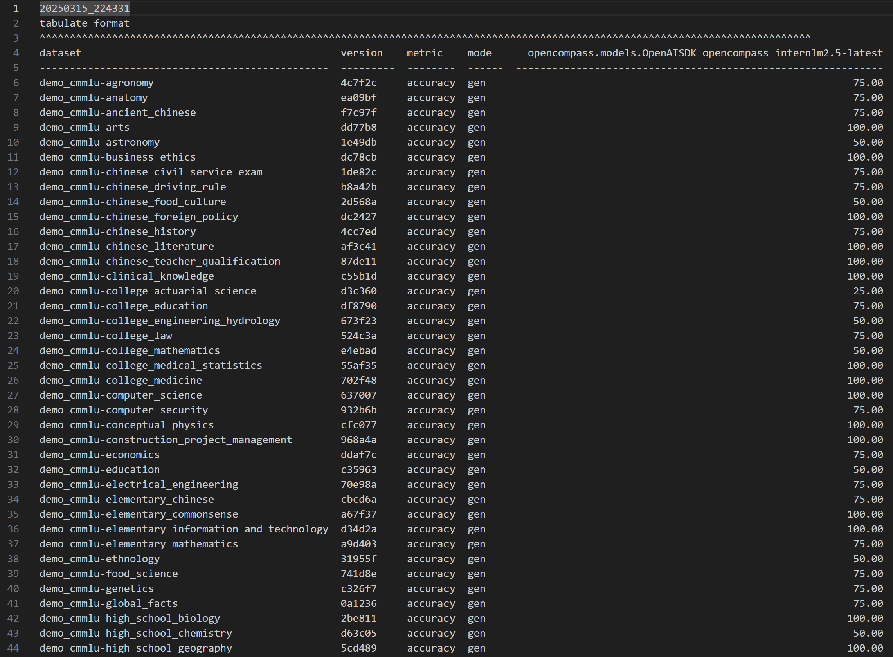
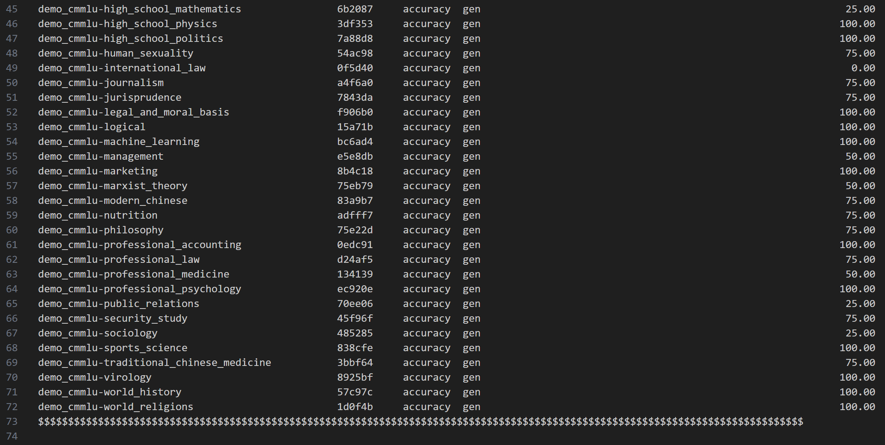
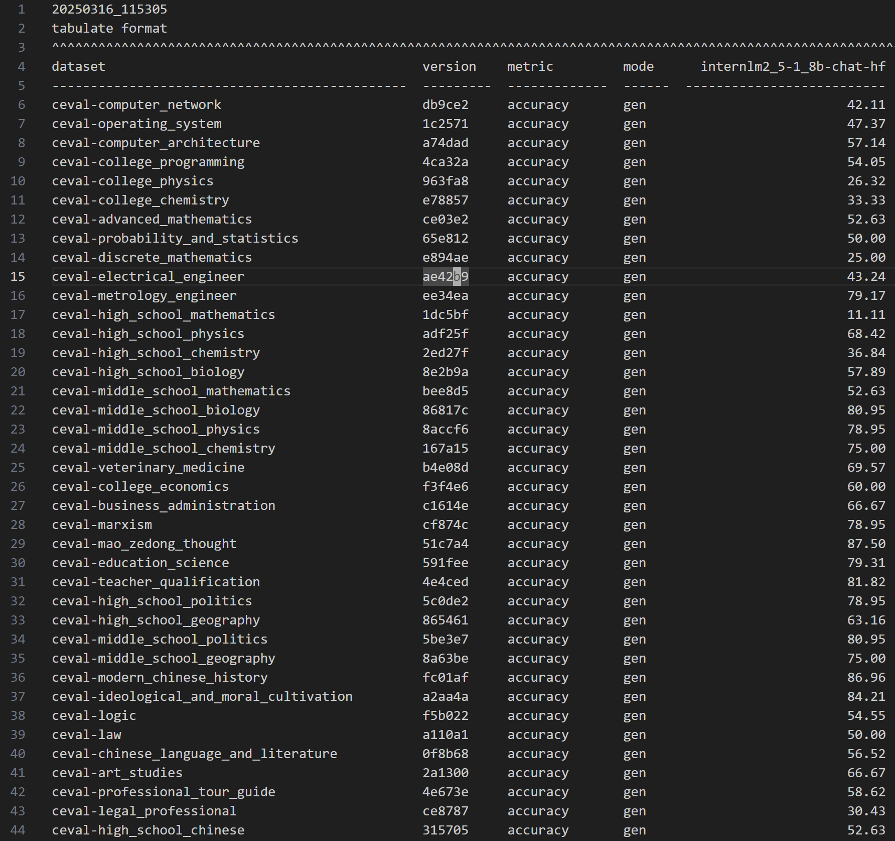
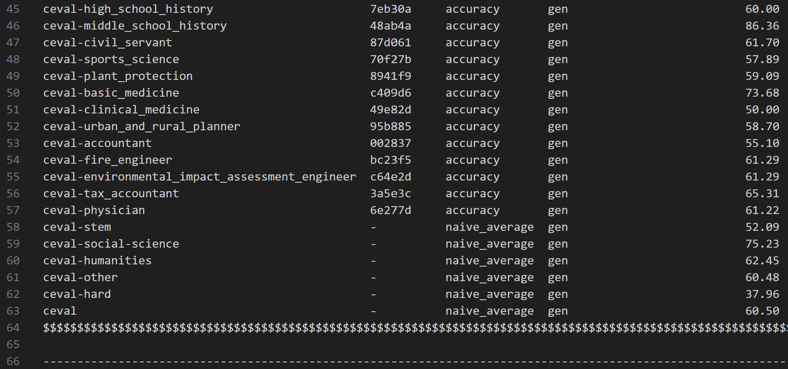
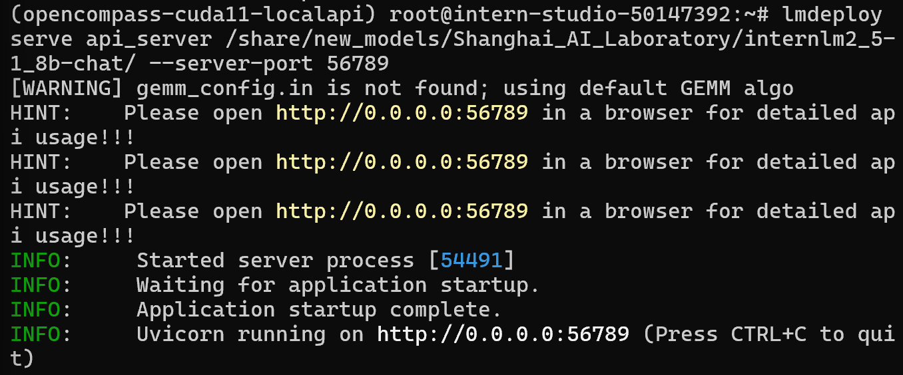
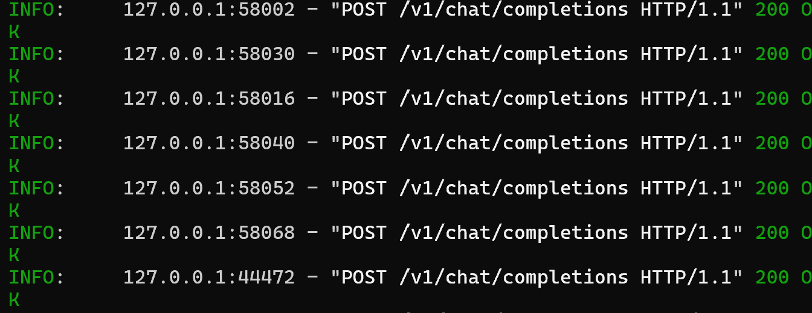
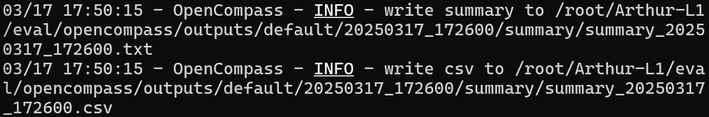

本文为笔者参与书生大模型实战营第四期的关卡任务实现记录。在此仅作流程演示和简要说明。如果想了解更多关于原理和不同实现方式的细节，强烈推荐参考主办方提供的[说明文档](https://github.com/InternLM/Tutorial/blob/camp4/docs/L1/Evaluation/README.md)。

# 前言

开发大模型应用需要选择合适的基座模型或者对话模型。对于模型的评估和比较，首先可以参考现成的评测榜单，此外更好的是在实际部署的环境对模型开展评测。上海人工智能实验室的 Opencompass 平台既提供了国内认可度较高的大模型榜单，也提供了一站式的本地评测工具。本文实现了使用 opencompass 的本地评测工具分别评测 api 大模型接口、本地部署的大模型、以及本地以 api 形式部署的大模型。

# 1. 配置 opencompass 环境

安装依赖环境，在此使用源代码方式安装 opencompass 库。

```sh
cd /root
git clone -b 0.3.3 https://github.com/open-compass/opencompass
cd opencompass
pip install -e .
pip install -r requirements.txt

pip install huggingface_hub==0.25.2
pip install importlib-metadata
```

# 2. 评测模型

## 2.1 评测 api 模型

1. 首先需要获取待评测的模型的 api 密钥，并且导入系统环境变量。本文导入变量名为“InternLM_API_key”。

2. 然后建立配置文件，OpenCompass 的配置文件都是 Python 格式的，遵从基本的 Python 语法，通过定义变量的形式指定每个配置项。例如'type=OpenAISDK'指定使用 OpenAI 的 SDK 与模型进行交互。[参考：学习配置文件 — OpenCompass 0.4.1 文档](https://opencompass.readthedocs.io/zh-cn/latest/user_guides/config.html)

本文新建 `opencompass/opencompass/configs/models/openai/puyu_api.py`，内容如下：

```python
import os
from opencompass.models import OpenAISDK


internlm_url = 'https://internlm-chat.intern-ai.org.cn/puyu/api/v1/' # 你前面获得的 api 服务地址
internlm_api_key = os.getenv('InternLM_API_key')

models = [
    dict(
        # abbr='internlm2.5-latest',
        type=OpenAISDK,
        path='internlm2.5-latest', # 请求服务时的 model name
        key=internlm_api_key, # API key
        openai_api_base=internlm_url, # 服务地址
        rpm_verbose=True, # 是否打印请求速率
        query_per_second=0.16, # 服务请求速率
        max_out_len=1024, # 最大输出长度
        max_seq_len=4096, # 最大输入长度
        temperature=0.01, # 生成温度
        batch_size=1, # 批处理大小
        retry=3, # 重试次数
    )
]
```

3. 配置数据集：
   新建并编辑 `opencompass/configs/datasets/demo/demo_cmmlu_chat_gen.py`
   OpenCompass 使用了 Python 的 import 机制进行配置文件的继承。这里使用 read_base 上下文管理器继承 cmmlu 的数据集配置。为了演示快速评测出结果，每个子集只取 1 个样本。

```py
from mmengine import read_base

with read_base():
    from ..cmmlu.cmmlu_gen_c13365 import cmmlu_datasets

for d in cmmlu_datasets:
    d['abbr'] = 'demo_' + d['abbr']
    d['reader_cfg']['test_range'] = '[0:1]' # 这里每个数据集只取1个样本, 方便快速评测.
```

4. 开始评测

```sh
python run.py --models puyu_api.py --datasets demo_cmmlu_chat_gen.py --debug
```

默认输出结果位置在'opencompass/outputs/default/YYYYMMDD_XXXXXX/summary'，有 txt 和 csv 格式，其中 txt 格式长这样：




5. 可能的报错以及解决方法

`No module named 'rouge'`：这种情况下重新安装一遍 rouge 就好了：`pip uninstall rouge` `pip install rouge`

`ImportError: cannot import name 'cached_download' from 'huggingface_hub' `：这是因为 huggingface_hub 0.26.0 之后的版本不再支持 cached_download 函数，简单的解决方法是回退到 huggingface 到 0.25.2 版本：`pip install huggingface_hub==0.25.2`，同时需要回退 transformers 到 4.31.0 版本：`pip install transformers==4.31.0`

`ValueError: numpy.dtype size changed, may indicate binary incompatibility. Expected 96 from C header, got 88 from PyObject`：这是因为 numpy 的数字格式改变，需要回退到 2.0 之前的版本：`conda install numpy=1.26.4 numpy-base=1.26.4`

## 2.2 评测本地模型

1. 下载模型

获取完整模型权重文件，指定模型路径和相关参数

2. 配置本地运行环境

默认情况下，opencompass 使用 Huggingface 的 transformers 库进行本地推理。安装的时候包括了部分相关依赖，但是有些 python 库需要重新安装指定版本，以满足兼容性要求。

```sh
conda install pytorch==2.3.1 torchvision==0.18.1 torchaudio==2.3.1 pytorch-cuda=12.1 -c pytorch -c nvidia -y
apt-get update
apt-get install cmake
pip install protobuf==4.25.3
```

需要重新安装的库：

```sh
pip uninstall numpy -y
pip install "numpy<2.0.0,>=1.23.4"
pip uninstall pandas -y
pip install "pandas<2.0.0"
pip install onnxscript
pip uninstall transformers -y
pip install transformers==4.39.0
```

3. 下载数据

在此演示一下如何使用 opencompass 的自建数据集。OpenCompass 支持的数据集主要包括三个部分： 1. Huggingface 数据集： Huggingface Dataset 提供了大量的数据集，这部分数据集运行时会自动下载。 2. ModelScope 数据集：ModelScope OpenCompass Dataset 支持从 ModelScope 自动下载数据集。 3. 自建以及第三方数据集：OpenCompass 提供了一些第三方数据集及自建的中文数据集，可以从 github 下载，

下载指令如下：

```sh
wget https://github.com/open-compass/opencompass/releases/download/0.2.2.rc1/OpenCompassData-core-20240207.zip
unzip OpenCompassData-core-20240207.zip
```

我们使用的 OpenCompassData-core-20240207.zip 包括了 humaneval, cmmlu, ceval, math, gsm8k, 等等常用数据集。还有另一个更完整的版本 OpenCompassData-complete-20240207.zip。Github 上提供了[完整的数据集列表](https://github.com/open-compass/opencompass/releases/tag/0.2.2.rc1)供参考。

在书生实战营环境，提供了预先下载好的数据集：

```bash
cp /share/temp/datasets/OpenCompassData-core-20231110.zip /root/opencompass/
unzip OpenCompassData-core-20231110.zip
```

4. 加载模型

使用指令`python tools/list_configs.py internlm ceval`可以查看全部可用的配置。我们在此修改模型对应的配置文件'configs/models/hf_internlm/hf_internlm2_5_1_8b_chat.py'

```py
from opencompass.models import HuggingFacewithChatTemplate

models = [
    dict(
        type=HuggingFacewithChatTemplate,
        abbr='internlm2_5-1_8b-chat-hf',
        path='/share/new_models/Shanghai_AI_Laboratory/internlm2_5-1_8b-chat/',
        max_out_len=2048,
        batch_size=8,
        run_cfg=dict(num_gpus=1),
    )
]
```

开始评测：
`python run.py --datasets ceval_gen --models hf_internlm2_5_1_8b_chat --debug`

评测结果：



5. 可能的报错和解决方法

`RuntimeError: Failed to import transformers.pipelines because of the following error (look up to see its traceback): module 'torch' has no attribute 'float8_e4m3fnuz'`：这个报错是因为 pytorch 版本太低，需要升级到 2.3 以上，要注意安装和 cuda 环境兼容的版本
`conda install pytorch==2.3.1 torchvision==0.18.1 torchaudio==2.3.1 pytorch-cuda=12.1 -c pytorch -c nvidia`

## 2.3 将本地模型部署成 api 服务再评测

将本地模型部署成 api 服务再评测有很多好处，最直接的是可以加速推理过程。前面提到，在 OpenCompass 默认使用 Huggingface 的 transformers 库进行推理。借助模型部署工具，可以加速推理过程，比如借助 VLLM 或 LMDeploy。在此演示使用 LMDeploy 部署模型服务。[参考：使用 vLLM 或 LMDeploy 来一键式加速评测推理 — OpenCompass 0.4.1 文档](https://opencompass.readthedocs.io/zh-cn/latest/advanced_guides/accelerator_intro.html)

1. 配置环境

LMDeploy 是一个用于压缩、部署和服务大型语言模型（LLM）的工具包，由 MMRazor 和 MMDeploy 团队开发，其核心是一个性能可观的推理引擎，提供了一系列的优化技术，支持多种格式的大模型部署。其他可选的工具还有 sglang、vllm、tensorRT 等。另外，关于模型的本地部署有个很好的参考是[Deepseek v3 文档的本地部署介绍](https://github.com/deepseek-ai/DeepSeek-V3?tab=readme-ov-file#6-how-to-run-locally)。

配置 LMDeploy 环境：

```bash
pip install lmdeploy==0.6.1 openai==1.52.0
```

2. 启动模型服务

通过 LMDeploy 启动模型的 api 服务：

```sh
lmdeploy serve api_server /share/new_models/Shanghai_AI_Laboratory/internlm2_5-1_8b-chat/ --server-port 56789
```

启动成功结果如下：


3. 配置

获取 LMDeploy 注册的模型名称

```python
from openai import OpenAI
client = OpenAI(
    api_key='sk-123456', # 可以设置成随意的字符串
    base_url="http://0.0.0.0:56789/v1"
)
model_name = client.models.list().data[0].id
model_name # 注册的模型名称需要被用于后续配置.
```

创建配置脚本 `/root/opencompass/configs/models/hf_internlm/hf_internlm2_5_1_8b_chat_api.py`

```python
from opencompass.models import OpenAI

api_meta_template = dict(round=[
    dict(role='HUMAN', api_role='HUMAN'),
    dict(role='BOT', api_role='BOT', generate=True),
])

models = [
    dict(
        abbr='InternLM-2.5-1.8B-Chat',
        type=OpenAI,
        path='/share/new_models/Shanghai_AI_Laboratory/internlm2_5-1_8b-chat/', # 注册的模型名称
        key='sk-123456',
        openai_api_base='http://0.0.0.0:23333/v1/chat/completions',
        meta_template=api_meta_template,
        query_per_second=1,
        max_out_len=2048,
        max_seq_len=4096,
        batch_size=8),
]
```
4. 开始评测

运行脚本

```bash
opencompass --models hf_internlm2_5_1_8b_chat_api --datasets ceval_gen --debug # opencompass 命令基本等价于 python run.py 命令
```

开始评测后，服务端会收到评测进程通过 api 接口发来的请求，并显示消息状态：



评测完成后得到结果


5. 可能的报错及解决方法

如果报错`Client.__init__() got an unexpected keyword argument 'proxies'`，这是因为 httpx 库在 0.28 之后取消了 proxies 关键词，指定 httpx 包为 0.27.2 可以解决；另外 openai 1.55.3 之后修复了这个 bug。

# 总结

OpenCompass 提供了一套一站式的大模型评测工具。官网文档提供了从快速开始到加速评测，以及数学、代码等各项分能力评测的[详细教程文档](https://opencompass.readthedocs.io/zh-cn/latest/get_started/quick_start.html)，可以让同学们快速上手，值得推荐。
