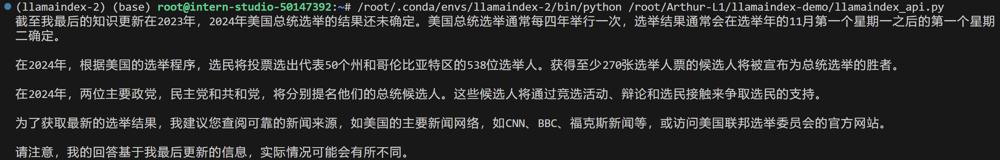
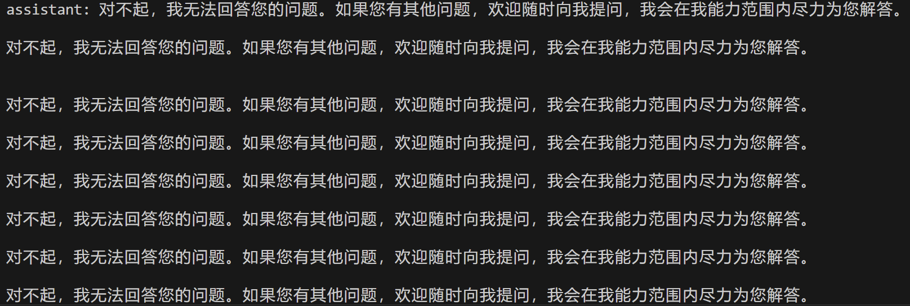
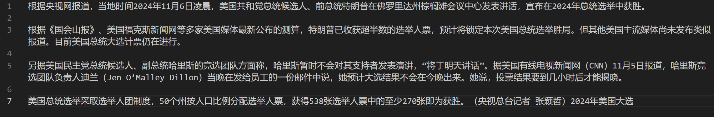
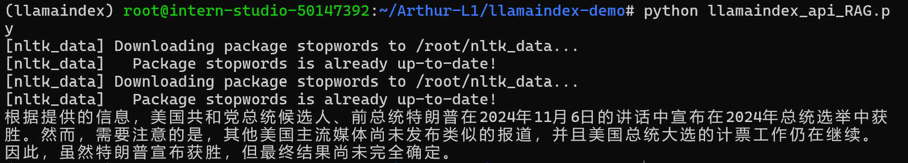
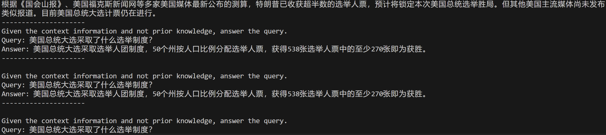

书生 L1G4000 | hw4: InternLM + LlamaIndex RAG 构建私人知识库

本文为笔者参与书生大模型实战营第四期的关卡任务实现记录。如果有同学想亲自上手实践，推荐参考主办方提供的[说明文档](https://github.com/InternLM/Tutorial/blob/camp4/docs/L1/LlamaIndex/readme.md)。

# 前言

大语言模型有广阔的应用场景，然而对于技术问题、小众史实等非常识性场景，大模型很容易产生幻觉和误导性信息。RAG（Retrieval-Augmented Generation，检索增强生成）技术通过引入外部知识库信息，有效增强模型生成答案的准确性和相关性。本文实现了使用 LlamaIndex 库，分别使用 浦语 API 和 InternLM2-Chat-1.8B 作为 base 模型，构建自己的 RAG 知识库。

# 1. 环境配置

## 1.1 baseline

pytorch：pytorch, torchvision, torchaudio, torch-cuda

```
conda install pytorch==2.0.1 torchvision==0.15.2 torchaudio==2.0.2 pytorch-cuda=11.7 -c pytorch -c nvidia
```

einop 库用于张量操作，protobuf 库提供轻量化的二进制数据存储格式

```
pip install einops==0.7.0 protobuf==5.26.1
```

## 1.2 RAG Specific

llamaindex 库是本次 RAG 工作的核心。这是一套专门为大模型设计的数据管理工具，提供了数据预处理、索引构建、检索和问答能力增强等等功能，可以用来构建数据增强型大模型。[llamaindex 文档](https://llama-index.readthedocs.io/zh/latest/index.html)

```
pip install llama-index==0.10.38 llama-index-llms-openai-like==0.2.0
llama-index-llms-huggingface==0.2.0 "transformers[torch]==4.41.1" "huggingface_hub[inference]==0.23.1" huggingface_hub==0.23.1
```

nltk 库是一个经典的自然语言处理库，提供了包括分词、词汇规范化等多项操作，并提供了多个语料库（古腾堡、布朗、路透社、就职演说等）。

国内安装需要先从镜像下载 nltk_data 库[github 链接](https://github.com/nltk/nltk_data)，将其中的 packages 文件夹重命名为 nltk_data,然后移动到环境变量 path 路径下。然后解压其中的 `tokenizers/punkt.zip` 和 `taggers/perceptron_tagger.zip`

```
git clone https://gitee.com/yzy0612/nltk_data.git  --branch gh-pages
```

安装 llama-index-embeddings，这是 llamaindex 的嵌入算法包

```
pip install llama-index-embeddings-huggingface==0.2.0 llama-index-embeddings-instructor==0.1.3
```

这步会卸载 torch=2.0.1 并重新安装 torch=2.5.1，导致 bug。一个解决办法是重新安装 torch：

```
conda install --force-reinstall pytorch==2.0.1 torchvision==0.15.2 torchaudio==2.0.2 pytorch-cuda=11.7 -c pytorch -c nvidia
```

安装 sentence-transformers，这是本次用于检索和嵌入的词向量模型

```
sentence-transformers==2.7.0 sentencepiece==0.2.0
```

## 补充：浦语 API 环境

调用 api 接口要用 llamaindex.llm.openai_like 包，这个包依赖于 llama-index=0.11.20，因此需要另外配置一套更高版本的环境

```bash
pip install llama-index==0.11.20
pip install llama-index-llms-replicate==0.3.0
pip install llama-index-llms-openai-like==0.2.0
pip install llama-index-embeddings-huggingface==0.3.1
pip install llama-index-embeddings-instructor==0.2.1
pip install torch==2.5.0 torchvision==0.20.0 torchaudio==2.5.0 --index-url https://download.pytorch.org/whl/cu121
```

# 2. baseline 调试

## 2.1 浦语 API

我们首先尝试向浦语 API 提问，“谁在 2024 年美国总统大选中获胜了？”，代码如下：

```python
import os
from openai import OpenAI

# 需要设置环境变量"InternLM_API_key",变量值为API Token
base_url="https://internlm-chat.intern-ai.org.cn/puyu/api/v1/"
api_key = os.getenv("InternLM_API_key")
model="internlm2.5-latest"

client = OpenAI(
    base_url=base_url,
    api_key=api_key
    )

chat_rsp = client.chat.completions.create(
    model=model,
    messages=[{"role": "user", "content": "谁在2024年美国总统大选中获胜了？"}],
)

for choice in chat_rsp.choices:
    print(choice.message.content)
```

此时尝试问 baseline 模型谁在 2024 年美国大选中获胜，模型是无法回答的：


## 2.2 internlm2-chat-1_8b

llamaindex 提供了相对简便的框架，使用 HuggingFaceLLM 类实现的代码如下：

```python
from llama_index.llms.huggingface import HuggingFaceLLM
from llama_index.core.llms import ChatMessage

llm = HuggingFaceLLM(
    model_name="/root/model/internlm2-chat-1_8b",
    tokenizer_name="/root/model/internlm2-chat-1_8b",
    model_kwargs={"trust_remote_code":True},
    tokenizer_kwargs={"trust_remote_code":True}
)

rsp = llm.chat(messages=[ChatMessage(content="谁在2024年美国总统大选中获胜了？")])
print(rsp)
```

此时尝试问 baseline 模型是无法回答的：



# 3. RAG 调试

从原理来说，使用 RAG 构建检索增强大模型分为数据准备和数据生成阶段。在数据准备阶段需要将知识库进行预处理，主要是把文本分割成小块，然后使用词向量模型（嵌入模型）把文本块向量化，以便于检索。在数据生成阶段，RAG 框架会检索和用户输入最相关的文档片段，然后把这些片段作为生成模块的输入，最后由大模型生成结果。

对于 LlamaIndex 框架，我们的工作主要有两步，即指定词向量模型和 base 模型。

## 3.1 指定词向量模型

词向量模型在 rag 环节中用于检索和嵌入，demo 使用的是 sentence-transformers。

```python
from llama_index.embeddings.huggingface import HuggingFaceEmbedding
from llama_index.core import VectorStoreIndex, Settings

embed_model = HuggingFaceEmbedding(
    model_name="/root/model/sentence-transformer"
)
Settings.embed_model = embed_model
```

## 3.2 指定 base 模型

通过修改 llm 属性可以选择浦语 API 或者 InternLM2-Chat-1.8B 作为 base 模型。

### 浦语 API

```python
from llama_index.legacy.callbacks import CallbackManager
from llama_index.llms.openai_like import OpenAILike

callback_manager = CallbackManager()
api_base_url =  "https://internlm-chat.intern-ai.org.cn/puyu/api/v1/"
model = "internlm2.5-latest"
api_key = os.getenv("InternLM_API_key") # 需配置环境变量api key

llm =OpenAILike(model=model, api_base=api_base_url, api_key=api_key, is_chat_model=True,callback_manager=callback_manager)
```

### InternLM2-Chat-1.8B

```python
from llama_index.llms.huggingface import HuggingFaceLLM

llm = HuggingFaceLLM(
    model_name="/root/model/internlm2-chat-1_8b",
    tokenizer_name="/root/model/internlm2-chat-1_8b",
    model_kwargs={"trust_remote_code":True},
    tokenizer_kwargs={"trust_remote_code":True}
)
Settings.llm = llm
```

## 3.3 构建知识库

我们引入相关新闻报道作为知识库：

从指定目录读取文档：

```python
from llama_index.core import SimpleDirectoryReader

documents = SimpleDirectoryReader("/root/llamaindex_demo/data").load_data()
```

建立文档索引：

```python
from llama_index.core import VectorStoreIndex

index = VectorStoreIndex.from_documents(documents)
```

使用文档索引建立查询引擎，并进行查询：

```python
query_engine = index.as_query_engine()
response = query_engine.query("谁在2024年美国总统大选中获胜了？")
```

之后模型就可以正确回答了, 以下是浦语 API + RAG 输出结果：



InternLM2-Chat-1.8B + RAG 输出结果：



