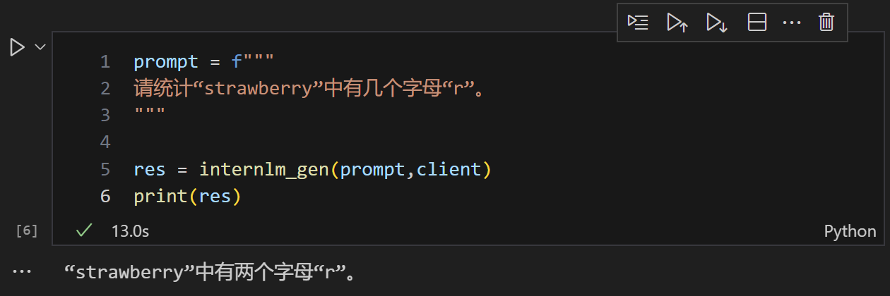
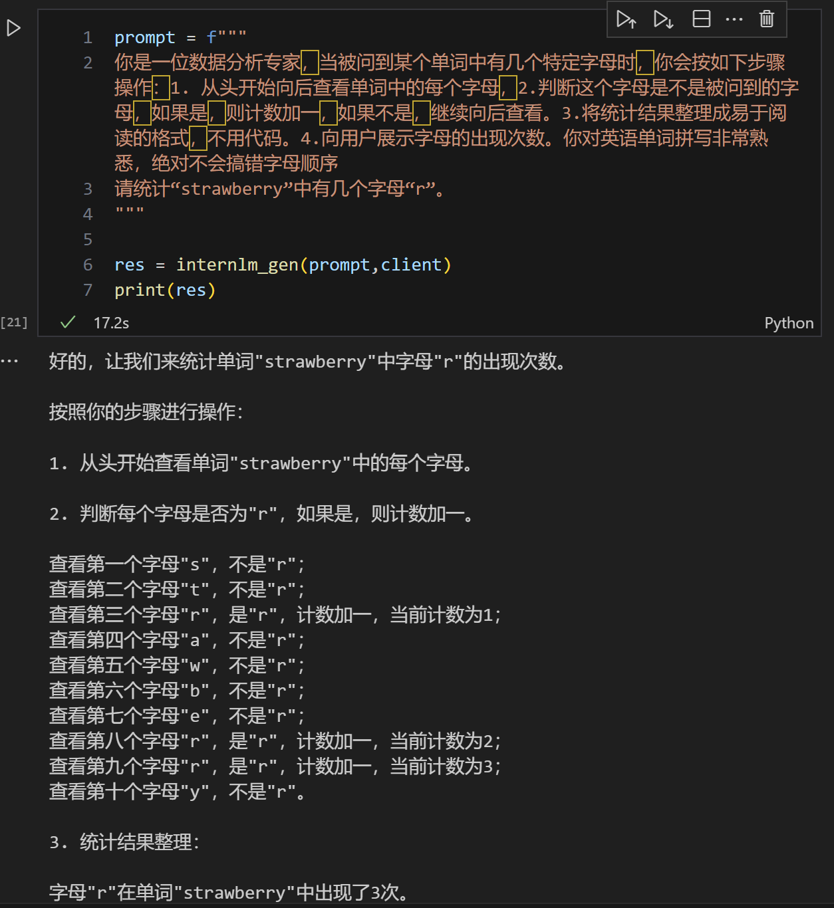

本文为笔者参与书生大模型实战营第四期的关卡任务实现记录。在此仅作流程演示和简要说明。如果想了解更多关于原理和不同实现方式的细节，强烈推荐参考主办方提供的[说明文档](https://github.com/InternLM/Tutorial/blob/camp4/docs/L1/Prompt/README.md)。

# 课程任务
l1-prompt 课程任务如下：

1. 通过提示词引导大模型完成字母统计
2. (可选) 任选下列其中一个任务编写提示词
    - 公文写作助手
    - 商务邮件沟通
    - 温柔女友/男友
    - MBTI 性格测试
    - 剧本创作助手
    - 科幻小说生成

# 1. 通过提示词引导大模型完成字母统计
任务要求：利用对提示词的精确设计，引导语言模型正确回答出“strawberry”中有几个字母“r”

## baseline
假如直接提问，大模型回答不出正确答案

## 修改提示词后

# 2. 编写提示词完成任务

