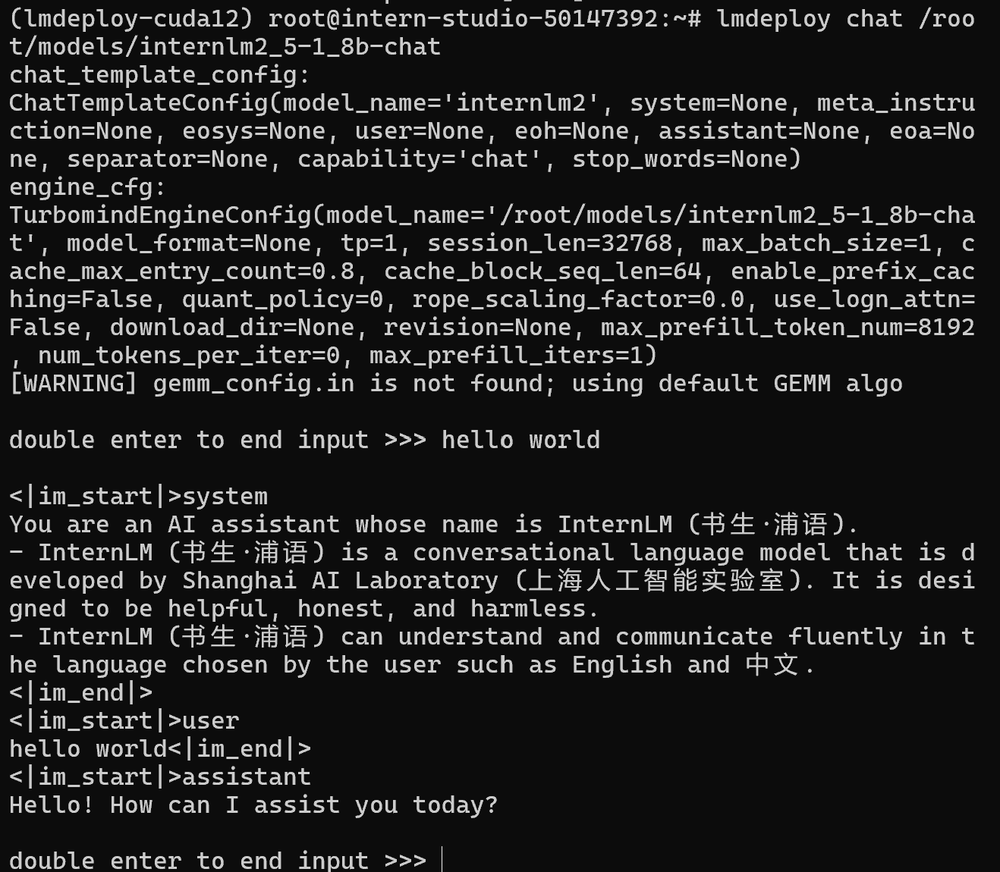
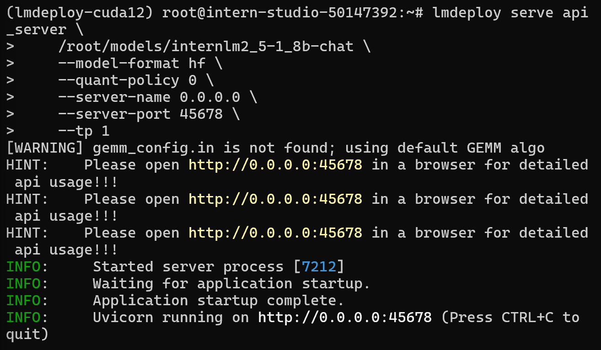
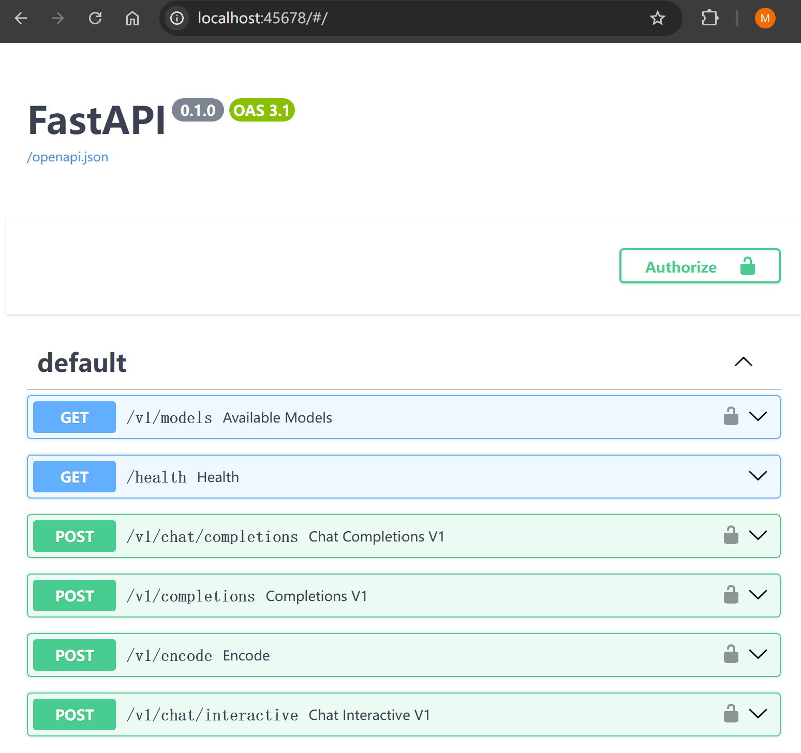
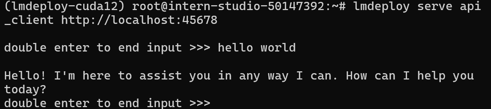
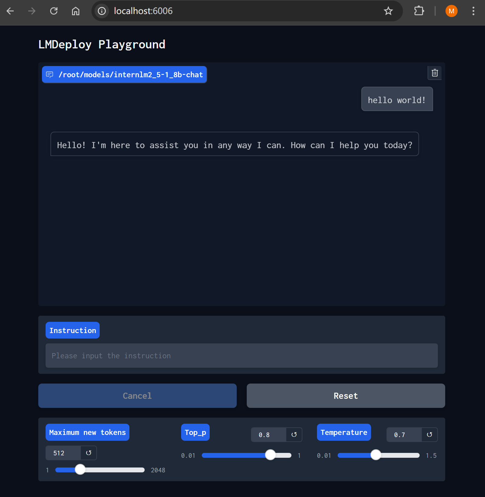
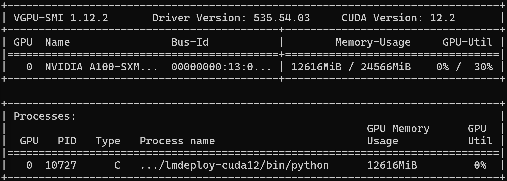
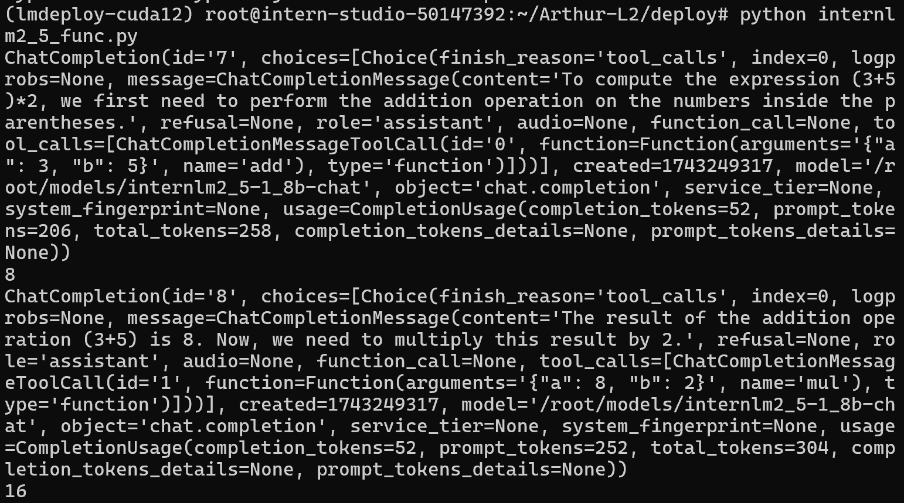

本文为笔者参与书生大模型实战营第四期的关卡任务实现记录。如果有同学想亲自上手实践，推荐参考主办方提供的[说明文档](https://github.com/InternLM/Tutorial/blob/camp4/docs/L2/LMDeploy/readme.md)。

# 前言

本地部署大模型是开发大模型应用的必备前置工作。为提高大模型在本地的训练和推理性能，可以通过模型量化缩短参数精度。本文实现了使用上海人工智能实验室开发的 lmdeploy 框架在本地量化和部署 internlm 2.5 1.8B 模型，并通过 OpenAI 库的函数调用接口实现了让大模型调用函数。

# 1. 本地命令行部署

## 1.1 配置环境

```sh
conda install pytorch==2.1.2 torchvision==0.16.2 torchaudio==2.1.2 pytorch-cuda=12.1 -c pytorch -c nvidia -y
pip install timm==1.0.8 openai==1.40.3 lmdeploy[all]==0.5.3
pip install datasets==2.19.2
```

## 1.2 获取模型

[官方文档](https://lmdeploy.readthedocs.io/zh-cn/latest/supported_models/supported_models.html)提供了 lmdeploy 支持的模型列表。关于从 Hugging Face 下载模型可以参考这篇文章：[如何快速下载 huggingface 模型——全方法总结 - 知乎](https://zhuanlan.zhihu.com/p/663712983?s_r=0)

实战营的开发环境提供了下载好的模型：

```sh
mkdir /root/models
ln -s /root/share/new_models/Shanghai_AI_Laboratory/internlm2_5-7b-chat /root/models
ln -s /root/share/new_models/Shanghai_AI_Laboratory/internlm2_5-1_8b-chat /root/models
ln -s /root/share/new_models/OpenGVLab/InternVL2-26B /root/models
```

## 1.3 启动对话

模型下载完成之后通过 `lmdeploy chat` 指令即可在控制台启动本地对话，由此可以快速检验下载的模型文件是否可以正常工作。

```sh
lmdeploy chat /root/models/internlm2_5-1_8b-chat
```



在此我们输入“hello world”，模型回复了“Hello! How can I assist you today?”，可以正常工作。

# 2. 通过 api 形式部署模型

生产环境部署的大模型需要和程序对话，因此一般需要部署成 api 形式，向程序提供调用接口。lmdeploy 框架提供了 `lmdeploy serve api_server` 指令，用于启动 api 服务器。

```sh
lmdeploy serve api_server \
    /root/models/internlm2_5-1_8b-chat \
    --model-format hf \
    --quant-policy 0 \
    --server-name 0.0.0.0 \
    --server-port 45678 \
    --tp 1
```

其中第一个参数`/root/models/internlm2_5-1_8b-chat`是模型路径，`--model-format`参数指定模型格式，`--quant-policy`参数制定了量化策略，后面会用到，`--server-name`和`--server-port`分别指定服务器的地址和端口，`--tp 1`参数表示并行 GPU 数量



进行端口转发后可以在本地浏览器打开，说明部署成功。



此时可以新建一个进程，使用`nvidia-smi`指令查看显存占用情况，本文是在书生实战营提供的环境，因此使用`studio-smi`。


在此可以看到，当前显存占用 20808MB

## 2.1 用命令行连接到 API 服务器

启动 api 服务器后，可以通过 `lmdeploy serve api_client` 命令连接到服务器，开启对话

```sh
lmdeploy serve api_client http://localhost:45678
```



输出结果和直接在命令行部署是一样的。

## 2.2 用 Gradio 网页连接到 API 服务器

lmdeploy 提供了一个简单的 gradio 界面，用于快速在创建模型 demo。同时，官网文档还提供了在 huggingface 上创建模型的在线 demo 的教程。[部署 gradio 服务 — lmdeploy 官方文档](https://lmdeploy.readthedocs.io/zh-cn/latest/llm/gradio.html)

我们通过命令`lmdeploy serve gradio`启动 gradio 服务：

```sh
lmdeploy serve gradio http://localhost:45678 \
    --server-name 0.0.0.0 \
    --server-port 6006
```

转发 gradio 服务器的端口 6006 并在本地打开：



gradio 界面下方的拖动条可以快速调整参数。关于大模型的 top_p 和 temperature 参数，简单地说，top_p 取值在 0-1 之间，越接近 1 模型的备选项会越多；temperature 理论取值范围是 0-正无穷，在此最大可以取 1.5，取值越大模型越倾向于随机选择备选项（而不是高分备选项）。感兴趣的同学可以参考这篇文章：[大模型文本生成——解码策略（Top-k & Top-p & Temperature）](https://www.zhihu.com/tardis/zm/art/647813179)

## 2.3 调用 OpenAI 库的 API 接口

使用 OpenAI 库的 API 接口是调用大模型能力的常见方式。我们只需编辑模型认证信息、任务描述和参数，即可获取模型的响应。在此提供一个简单的 python 模板：

```py
# 导入openai模块中的OpenAI类，这个类用于与OpenAI API进行交互
from openai import OpenAI


# 创建一个OpenAI的客户端实例，需要传入API密钥和API的基础URL
client = OpenAI(
    api_key='YOUR_API_KEY',
    # 替换为你的OpenAI API密钥，由于我们使用的本地API，无需密钥，任意填写即可
    base_url="http://0.0.0.0:45678/v1"
    # 指定API的基础URL，这里使用了本地地址和端口
)

# 调用client.models.list()方法获取所有可用的模型，并选择第一个模型的ID
# models.list()返回一个模型列表，每个模型都有一个id属性
model_name = client.models.list().data[0].id

# 使用client.chat.completions.create()方法创建一个聊天补全请求
# 这个方法需要传入多个参数来指定请求的细节
response = client.chat.completions.create(
  model=model_name,
  # 指定要使用的模型ID
  messages=[
  # 定义消息列表，列表中的每个字典代表一个消息
    # 系统消息，定义ai助手的行为
    {"role": "system", "content": "你是一个友好的小助手，负责解决问题."},
    # 用户消息，在这里输入prompt
    {"role": "user", "content": "hello world"},

  ],
    temperature=0.8,
    # 控制生成文本的随机性，值越高生成的文本越随机
    top_p=0.8
    # 控制生成文本的多样性，值越高生成的文本越多样
)

# 打印出API的响应结果
print(response.choices[0].message.content)
```

# 3. 提升部署性能

## 3.1 设置 kv cache

在 Transformer 架构的自注意力模块中有 q、k、v 三个动态生成的矩阵，其中 k 和 v 这两个矩阵在推理阶段生成每个新词时不需要重新计算，因此可以通过缓存加速推理过程。

对于 lmdeploy, kv cache 是默认开启的。我们可以通过调整 kv cache 的大小和参数精度，优化模型对 GPU 资源的利用。在默认情况下，kv cache 大小为剩余显存的 80%，参数精度为 fp16。可选的 kv cache 精度有 int4 和 int8。官方文档评测了多个模型在不同量化方式下的推理表现，结果参见 [Key-Value(KV) Cache 量化 — lmdeploy 官方文档](https://lmdeploy.readthedocs.io/zh-cn/latest/quantization/kv_quant.html)。

我们通过以下指令设置 kv cache：

```sh
lmdeploy serve api_server \
    /root/models/internlm2_5-1_8b-chat \
    --model-format hf \
    --quant-policy 4 \
    --cache-max-entry-count 0.4\
    --server-name 0.0.0.0 \
    --server-port 45678 \
    --tp 1
```

`quant_policy` 参数设置为 4 表示 kv int4 量化，如果设置为 8 表示 kv int8 量化
`cachemax-entry-count`参数表示 kv cache 大小占剩余显存的比例，默认为 0.8

我们同样监测显存使用情况


可以看到，在设置 kv cache 占比后显存占用为 12616MB。相比未设置时占用 20808MB 有了较大优化。

优化的大小可以通过简单的估算解释：

    1、在 BF16 精度下，1.8B 模型权重占用3.6GB：18×10^9 parameters×2 Bytes/parameter=3.6GB

    2、kv cache 占用16.32GB：剩余显存24-3.6=20.4GB，kv cache 默认占用 80%，即20.4\*0.8=16.32GB

    3、由此反推计算其他项大约0.88GB：实际占用20.8GB-权重占用3.6GB-kv cache 占用16.32GB=0.88GB。

对于修改 kv cache 占用之后的显存占用情况(12.6GB)：

    1、在 BF16 精度下，1.8B 模型权重占用3.6GB

    2、kv cache 占用4GB：剩余显存24-3.6=20.4GB，kv cache 修改为占用 40%，即20.4\*0.4=8.16GB

    3、其他项0.88GB

由此估算 总占用显存=权重占用 14GB+kv cache 占用 4GB+其它项 0.88GB = 12.64GB，与实际占用基本一致。

## 3.2 模型量化

模型量化是 LMDeploy 中应用的一种优化技术，本质上是对模型进行有损压缩，牺牲精度换取减小模型的空间占用并提高推理速度。例如 W4A16 量化表示权重变量改用 4 位整数表示，激活变量改用 16 位浮点数表示。

我们可以通过如下的指令启动量化：

```sh
lmdeploy lite auto_awq \
   /root/models/internlm2_5-1_8b-chat \
  --calib-dataset 'ptb' \
  --calib-samples 128 \
  --calib-seqlen 2048 \
  --w-bits 4 \
  --w-group-size 128 \
  --batch-size 1 \
  --search-scale False \
  --work-dir /root/models/internlm2_5-1_8b-chat-w4a16-4bit
```

`lite`指令由于启动量化任务，参数 `auto_awq` 表示自动权重量化，`--calib-dataset`用于指定校准数据集，`--calib-samples`指定校准样本数量，`--calib-swqlen 2048`用于指定校准过程的序列长度，`--w-bits`指定权重的位数，`--work-dir`指定量化后新模型的存放位置

在此如果报错：`TypeError: 'NoneType' object is not callable`，可能的原因是当前版本的 datasets3.0 无法下载 calibrate 数据集通过`pip install datasets==2.19.2` 可以解决。

# 4. 让模型调用函数

通过前面的步骤，我们已经可以在本地部署大模型并开启对话了。要想真正发挥大模型的威力，我们需要让它能够更进一步执行操作。为此，可以使用 OpenAI python API 的函数调用功能（function calling）。

简单来说，函数调用首先需要在请求的 tools 字段告诉大模型有哪些函数可以调用；然后当大模型在对话中决定调用函数时，本地需要根据大模型提供的参数执行相应的函数，并把结果返回给大模型。更多细节可以参考 OpenAI 的官方文档 [Function calling - OpenAI API](https://platform.openai.com/docs/guides/function-calling?api-mode=responses&example=search-knowledge-base#handling-function-calls)。

接下来我们使用函数调用功能，自定义加法函数 `add()` 和乘法函数 `mul()`，帮助大模型正确计算 `(3+5)*2`。

我们首先写一个简单的加法函数`add()`：

```py
def add(a: int, b: int):
    return a + b
```

然后我们需要在 tools 字段声明这个函数，在 `description` 字段写下函数的描述，`parameters` 字段写下参数的描述。

```py
tools = [{
    "type": "function",
    "function": {
        "name": "add",
        "description": "use this function to calculate the addition of two numbers",
        "parameters": {
            "type": "object",
            "properties": {
                "a": {
                    "type": "int",
                    "description": "the first number to add"
                },
                "b": {
                    "type": "int",
                    "description": "the second number to add"
                }
            },
            "required": ["a", "b"]
        }
    }
}]
```

类似地，我们再写一个乘法函数 `mul()` 并且和上面一样在 tools 字段添加声明。

然后我们写下提示词，让大模型计算 `(3+5)*2` 。为了让大模型更稳定地调用模型，我们在提问之前加了一条系统引导，提醒大模型调用函数解决数学问题。

```py
messages = []
# 系统引导
messages.append({'role': 'system', 'content': 'if asked to do math, call function tools.'})
# 用户提问
messages.append({'role': 'user', 'content': 'Compute (3+5)*2'})
```

发送请求，引用前面声明的 `tools`。

```py
response = client.chat.completions.create(
    model=model_name,
    messages=messages,
    temperature=0.8,
    top_p=0.8,
    stream=False,
    tools=tools) # 引用前面声明的tools
```

下一步我们需要解析大模型返回的函数调用信息，将函数名读入`func1_name`，函数参数读入`func1_args`。

```py
func1_name = response.choices[0].message.tool_calls[0].function.name
func1_args = response.choices[0].message.tool_calls[0].function.arguments
```

然后在本地调用函数得到结果，在此使用 python 内置的 `eval()` 函数。

```py
func1_out = eval(f'{func1_name}(**{func1_args})')
```

接下来把运行结果添加到历史消息，返回给大模型：

```python
messages.append({
    'role': 'environment',
    'content': f'3+5={func1_out}',
    'name': 'plugin'
})
```

这样就成功完成了一次函数调用。我们的例子里需要两次函数调用，分别调用`add()`函数和`mul()` 函数。第二次和前面类似，在此不加赘述。

完整运行结果：



可以看到通过两次函数调用完成 `(3+5)*2` 的计算，第一次调用 `add()`函数计算 `5+3=8`, 第二次调用`mul()`函数计算 `8*2=16`。

实验中发现不同模型的函数调用能力有明显差异。笔者实验中分别使用了 1.8b 和 7b 两个版本的书生 internlm 2.5 模型。使用 1.8b 版本模型时，第一次调用大多不成功；而 7b 版本第一次调用就可以正确使用函数输出结果。

完整代码如下：

```py
from openai import OpenAI

# 加法函数
def add(a: int, b: int):
    return a + b


def mul(a: int, b: int):
    return a * b


tools = [{
    "type": "function",
    "function": {
        "name": "add",
        "description": "use this function to calculate the addition of two numbers",
        "parameters": {
            "type": "object",
            "properties": {
                "a": {
                    "type": "int",
                    "description": "the first number to add"
                },
                "b": {
                    "type": "int",
                    "description": "the second number to add"
                }
            },
            "required": ["a", "b"]
        }
    }
}, {
    'type': 'function',
    'function': {
        'name': 'mul',
        'description': 'use this function to calculate the multiplication of two numbers',
        'parameters': {
            'type': 'object',
            'properties': {
                'a': {
                    'type': 'int',
                    'description': 'the first number to multiply',
                },
                'b': {
                    'type': 'int',
                    'description': 'the second number to multiply',
                },
            },
            'required': ['a', 'b'],
        },
    }
}]
messages = []
# 系统引导
messages.append({'role': 'system', 'content': 'if asked to do math, call function tools.'})
# 用户提问
messages.append({'role': 'user', 'content': 'Compute (3+5)*2'})

client = OpenAI(api_key='YOUR_API_KEY', base_url='http://0.0.0.0:45678/v1')
model_name = client.models.list().data[0].id
response = client.chat.completions.create(
    model=model_name,
    messages=messages,
    temperature=0.8,
    top_p=0.8,
    stream=False,
    tools=tools) # 引用前面声明的tools
print(response)
func1_name = response.choices[0].message.tool_calls[0].function.name
func1_args = response.choices[0].message.tool_calls[0].function.arguments
func1_out = eval(f'{func1_name}(**{func1_args})')
print(func1_out)

messages.append({
    'role': 'assistant',
    'content': response.choices[0].message.content
})
messages.append({
    'role': 'environment',
    'content': f'3+5={func1_out}',
    'name': 'plugin'
})
response = client.chat.completions.create(
    model=model_name,
    messages=messages,
    temperature=0.8,
    top_p=0.8,
    stream=False,
    tools=tools)
print(response)
func2_name = response.choices[0].message.tool_calls[0].function.name
func2_args = response.choices[0].message.tool_calls[0].function.arguments
func2_out = eval(f'{func2_name}(**{func2_args})')
print(func2_out)
```
